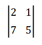
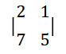
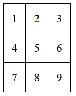
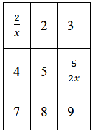
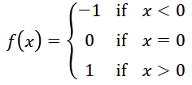
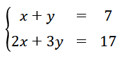
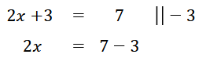
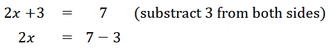

# Nordic Guidelines for Mathematical Content in HTML Files, Using MathML

## Introduction

This guidelines document is a joint effort between the (mostly) Nordic agencies dedicated to providing accessible literature in different formats – e.g. talking books, braille, and accessible e-books – to children and adults with various reading impairments or special needs. The participating organisations are [Celia](https://www.celia.fi/), [HBS](https://hbs.is/), [MTM](https://mtm.se), [NB](https://www.nb.no/), [Nota](https://nota.dk/), [SBS](https://www.sbs.ch/), [SPSM](https://www.spsm.se/), and [Statped](http://statped.no/).

Making book content accessible starts in well-structured and granular semantic markup using available markup and accessibility standards. When it comes to mathematics, the quality of the markup is essential in order for assistive technology to be able to correctly and unambiguously convey the information to the reader. It is not enough that the visual representation of a mathematical expression looks correct, the structure of the expression needs to be correctly expressed in the markup. The purpose of this document is to give further guidance in how to properly construct mathematical expressions that will give any user a correct understanding of the expression.

The basis of this document is the [MathML Core specification](https://www.w3.org/TR/mathml-core/). The aim is to provide a better understanding of how to use the MathML standard in the context of the services provided by the Nordic Agencies. The target audience of the document is mainly the Nordic agencies’ contracted EPUB 3 suppliers, but the guidelines will also be used by staff at the Nordic agencies, other vendors and interested parties, etc. Note that this document is not a beginner's introduction to MathML. A certain familiarity with the format is required, as well as a good understanding of basic mathematics.

## When To Use MathML <!--- maybe change wording later -->

As a general rule, every mathematical or scientific expression that can't be rendered with standard HTML must be captured as MathML, whereas things that can be rendered with standard HTML, like numbers, units, single Unicode characters and even simple arithmetic expressions, should be captured as HTML. However, there may be a valid point to use MathML a bit more extensively in some cases, especially in STEM content.    

### Numbers

Plain numbers, with or without decimal points or commas, are not necessary to mark up with MathML markup. They are required to be captured as plain text, formatted as in the source material. Points, commas, spaces etc. must be preserved.

### Numbers With Units

In general, numbers with attached units do not require MathML markup. The units should in most cases be captured as plain text using Unicode for any Greek symbols and `<sup>` for any exponents. However, in STEM content the Ordering Agencies may require MathML markup in order for text-to-speech output to be consistent throughout the content.

### Single Variables or Symbols

Single occurrences of variables, normally displayed in italics, constants or other symbols do not require MathML markup. They can in most cases be captured as plain text using the proper characters or Unicode symbols. If they are displayed in italics in the source material they should be styled accordingly, using the standard HTML elements.

### Simple Arithmetic Expressions in Linear Form

Mathematical expressions, such as calculations, functions, equations etc., are in general required to be marked up using MathML. However, if there are one or a few isolated simple expressions in a non-STEM context, they may be captured as plain text as long as the expressions are linear and just simple arithmetic expressions such as "1 + 1 = 2" or "3 - 1 = 2". Anything more complex or containing non-standard characters or symbols is required to be captured as MathML.

### Chemistry

MathML markup is required to be use for chemistry content in general. However, if the source material contains occasional occurrences of chemical substances written like CO<sub>2</sub> or H<sub>2</sub>O, and no other type of chemistry notation, these can be captured using standard HTML. If MathML is used for other types of chemistry notation, then MathML must be used for all chemistry content in order to ensure a consistent output for the reader.

## MathML Fundamentals

### The Top-Level `<math>` Element

### Namespace

### alt-attributes

A `<math>` element has two different alt-attributes:
1. `alttext`
2. `altimg`.

The attribute `alttext` is used to provide an **alternative text** fallback for mathematical content when a reading system doesn't support MathML markup. Usually it is ASCIIMath or LaTeX as these formats are well known in STEM subjects. The Ordering Agency may decide which kind of content should be in the `alttext` attribute.

The attribute `altimg` is used to provide an **alternative image** fallback for mathematical content. Usually this is just a screenshot of the rendered equation. It should used with caution, since MathML Core does not support the `altimg` attribute. It is also only a visual fallback, because you can't provide an alternative text for the fallback image. The Ordering Agency may decide if the attribute is used.

### Block vs Inline

<!--- displaystyle="true" for block -->

### Presentation vs Content MathML

<!--- Next section is completely based on Presentation MathML -->

## Basic Markup Structure

### Token Elements

#### `<mn>`

The `<mn>` element is used to mark up all kinds of numeric characters. This also includes decimal and thousand separators. They shouldn't be mark up separate from the number.

There are different ways to mark up the decimal and thousand separators based on the publication. Follow the mark up of the publication unless specifically told otherwise by the Ordering Agency.


For example using 
- comma as a decimal separator: `<mn>3,14</mn>`
- non-breaking space as a thousand separator: `<mn>89&nbsp;000</mn>`
- period as a decimal separator: `<mn>2.74</mn>`
- comma as a thousand separator: `<mn>19,050</mn>`.

#### `<mo>` for operators, fences, separators or accents

The `<mo>` element is used to denote operators. The definition of an operator is loose and it can mean the actual mathematical operators plus (+), minus (&minus;), times (&centerdot;) and divided by (/).

In MathML it also means different parentheses. For example the parenthesis `<mo>(</mo>` and curly bracket `<mo>{</mo>`.

The same character can be used in a different meaning based on the context. For example the comma can be part of a number, but in a sequence the comma is an operator.

For example the sequence {1,2,3,...} written in MathML:
```html
<mo>{</mo>
<mn>1</mn>
<mo>,</mo>
<mn>2</mn>
<mo>,</mo>
<mn>3</mn>
<mi>...</mi>
<mo>}</mo>
```

Some characters are written with accents. Such as the average <math><mover><mi>x</mi><mo>&#8254;</mo></mover></math> (read as "x bar"). Here the accent "bar" is also an operator. MathML code:

```html
<mover>
    <mi>x</mi>
    <mo>&#8254;</mo>
</mover>
```

More about the usage of `<mover>` later on.

#### `<mi>` element for variables and functions

The `<mi>` element is used to denote variables and other identifiers. An identifier can be just one letter of symbol such as a variable $\alpha$ or $x$, but it can also be multiple letters such as function names: $\tan$, $\sin$ or $\log$.

The ellipsis or three dots &#x2026; are also an identifier `<mi>&#x2026;</mi>`.

#### `<mtext>`

### General Layout Schemata

#### `<mrow>`

The `<mrow>` element is used to group mathematical expressions and parts of expressions. This is important when it comes to other elements, which can only have two children. Example of this would be the `<mfrac>` element:

```html
<math>
    <mrow>
      <mo>(</mo>
      <mfrac>
        <mrow>
          <mn>1</mn>
          <mo>+</mo>
          <mfrac>
            <mn>2</mn>
            <mn>3</mn>
          </mfrac>
        </mrow>
        <mn>4</mn>
      </mfrac>
      <mo>)</mo>
    </mrow>
</math>
```

The `<mrow>` has to be used to group the whole numerator expression, so that it is properly part of the `<mfrac>`.

The `<mrow>` element is also used by the browser or reading software to render mathematics correctly. For example in the matrix markup, it is the reason the parentheses stretch to the sides of the matrix.

Example of rendering a determinant when the `<mrow>` has been used correctly:



Exampe of rendering a determinant when the `<mrow>` hasn't been used at all:



#### `<mfrac>`

#### `<msqrt>` and `<mroot>`

#### `<mpadded>` <!--- test with MathCAT first -->

### Script and Limit Schemata

#### Subscripts and Superscripts, `<msub>`, `<msup>`, `<msubsup>`

#### Underscripts and Overscripts, `<munder>`, `<mover>`, `<munderover>`

#### Prescripts and Postscripts, `<mmultiscripts>`

### Tabular Math

Math can be presented in a table-like structure and MathML has its own markup to handle this.

#### When to use the regular HTML `<table>`

Use a HTML `<table>` when it's possible. It should be used with presenting data and when MathML isn't needed (as per section When To Use MathML). Example of a table where HTML `<table>` should be used:



```html
<table>
    <tr>
        <td>1</td>
        <td>2</td>
        <td>3</td>
    </tr>
    <tr>
        <td>4</td>
        <td>5</td>
        <td>6</td>
    </tr>
    <tr>
        <td>7</td>
        <td>8</td>
        <td>9</td>
    </tr>
</table>
```

You can mix HTML and MathML markup inside the HTML `<table>`. Example:



```html
<table>
    <tr>
    <td>
        <math>
            <mfrac>
                <mn>2</mn>
                <mi>x</mi>
            </mfrac>
        </math>
    </td>
    <td>2</td>
    <td>3</td>
    </tr>
    <tr>
    <td>4</td>
    <td>5</td>
    <td>
        <math>
            <mfrac>
                <mn>5</mn>
                <mrow>
                    <mn>2</mn>
                    <mo>&#x2062;</mo>
                    <mi>x</mi>
                </mrow>
            </mfrac>
        </math>
    </td>
    </tr>
    <tr>
    <td>7</td>
    <td>8</td>
    <td>9</td>
    </tr>
</table>
```

### When to use the MathML `<mtable>`

If there is mathematical notation that can't be achieved with just an HTML `<table>`, then use MathML `<mtable>`.

Many times any mathematical notation, that spans multiple lines, should be marked up with the MathML `<mtable>`.

Some use cases for tabular math
- matrices
- determinants
- piecewise functions
- equation solving notation
- systems of equations.

Inside the `<mtable>` element there are also the row element `<mtr>` and the (data) cell element `<mtd>`. They are equivalent to the HTML `<table>` element's row `<tr>` and cell `<td>` elements.

Example of the rendering and markup for a determinant:


```html
<math>
    <mrow>
        <mo>|</mo>
        <mtable>
            <mtr>
                <mtd>
                    <mn>2</mn>
                </mtd>
                <mtd>
                    <mn>1</mn>
                </mtd>
            </mtr>
            <mtr>
                <mtd>
                    <mn>7</mn>
                </mtd>
                <mtd>
                    <mn>5</mn>
                </mtd>
            </mtr>
        </mtable>
        <mo>|</mo>
    </mrow>
</math>
```

Example of a piecewise function. It is important that the different expressions line up with each other. Here is the rendering and markup:



```html
<math>
    <mi>f</mi>
    <mrow>
      <mo>(</mo>
      <mi>x</mi>
      <mo>)</mo>
    </mrow>
    <mo>=</mo>
    <mrow>
      <mo>{</mo>
      <mtable>
        <mtr>
            <mtd>
                <mo>&#x2212;</mo>
                <mn>1</mn>
            </mtd>
            <mtd>
                <mtext>if</mtext>
            </mtd>
            <mtd>
                <mi>x</mi>
                <mo>&lt;</mo>
                <mn>0</mn>
            </mtd>
        </mtr>
        <mtr>
            <mtd>
                <mn>0</mn>
            </mtd>
            <mtd>
                <mtext>if</mtext>
            </mtd>
            <mtd>
                <mi>x</mi>
                <mo>=</mo>
                <mn>0</mn>
            </mtd>
        </mtr>
        <mtr>
            <mtd>
                <mn>1</mn>
            </mtd>
            <mtd>
                <mtext>if</mtext>
            </mtd>
            <mtd>
                <mi>x</mi>
                <mo>&gt;</mo>
                <mn>0</mn>
            </mtd>
        </mtr>
      </mtable>
    </mrow>
</math>
```

Some notation might look like tabular math, but isn't. Some possibilities for confusion:
- absolute value $|x+2|$
- intervals $[5,15]$.

If there is any confusion, you should reach out to the Ordering Agency.

#### Attributes `rowspan` and `columnspan`

If the rows and columns need to be spanned across multiple cells, use the `rowspan` and `columnspan` attributes. They are equivalent to the HTML attributes `rowspan` and `colspan`.

Notice that `columnspan` is written this way, because of backwards compatability for MathML 3.

#### Labeled Row in Table or Matrix, `<mlabeledtr>` <!--- needs investigating -->

## Context-Based Applications <!--- maybe change wording later -->

### Sums, Products, Integrals etc.

### Invisible Operators

Insivible operators are used when the meaning of an equation would be ambigious. For example $a(x+1)$ might be the function $a$ of $x+1$ or then it could be the multiplication between $a$ and $(x+1)$.

Using invisible operators makes the markup unambigious:

- insivible multiplication: `&#x2062;`
- invisible function application: `&#x2061;`
- invisible plus: `&#x2064;`
- invisible comma: `&#x2063;`

(Can be deleted later) Source: [MathML 4 "Invisible operators"](https://www.w3.org/TR/mathml4/#presm_invisibleops).

### Systems of Equations

Systems of equations are tabular math. See the section Tabular math for more information.

Example rendering and markup of a pair of equations:



```html
<math>
    <mrow>
        <mo>{</mo>
        <mtable>
            <mtr>
                <mtd> 
                    <mrow> 
                        <mi>x</mi>
                        <mo>+</mo>
                        <mi>y</mi>
                    </mrow> 
                </mtd>
                <mtd>
                    <mo>=</mo>
                </mtd>
                <mtd>
                    <mn>7</mn>
                </mtd>
            </mtr>
            <mtr>
                <mtd>
                    <mrow>
                        <mn>2</mn>
                        <mi>x</mi>
                        <mo>+</mo>
                        <mn>3</mn>
                        <mi>y</mi>
                    </mrow>
                </mtd>
                <mtd>
                    <mo>=</mo>
                </mtd>
                <mtd>
                    <mn>17</mn>
                </mtd>
            </mtr>
        </mtable>
    </mrow>
</math>
```

### Equation solving notation

Equation solving notation is tabular math. See the section Tabular math for more information.

The notation and layout is very similar to systems of equations, but equation solving usually has additional commentary about the equation in question.

Example of rendering and mark up of equation solving notation:



```html
<math>
    <mtable>
        <mtr>
            <mtd> 
                <mrow>
                    <mn>2</mn
                    <mo>&#x2062;</mo>
                    <mi>x</mi>
                    <mo>+3</mo>
                </mrow> 
            </mtd>
            <mtd>
                <mo>=</mo>
            </mtd>
            <mtd>
                <mn>7</mn>
            </mtd>
            <mtd>
                <mrow>
                    <mo>|</mo>
                    <mo>|</mo>
                </mrow>
                <mo>&#x2212;</mo>
                <mn>3</mn>
        </mtr>
        <mtr>
            <mtd>
                <mrow>
                    <mn>2</mn>
                    <mi>x</mi>
                </mrow>
            </mtd>
            <mtd>
                <mo>=</mo>
            </mtd>
            <mtd>
                <mn>7</mn>
                <mo>&#x2212;</mo>
                <mn>3</mn>
            </mtd>
            <mtd><--- Empty cell ---></mtd>
        </mtr>
    </mtable>
</math>
```

Notice that there is an empty cell underneath the $-3$ notation. This is so that the table cells line up properly.

This kind of mark up can have commentary text instead of the mathematical notation. This should be marked up inside the MathML `<mtable>` as well.

Example of the rendering and mark up of equation solving with commentary text:



```html
<math>
    <mtable>
        <mtr>
            <mtd> 
                <mrow>
                    <mn>2</mn
                    <mo>&#x2062;</mo>
                    <mi>x</mi>
                    <mo>+3</mo>
                </mrow> 
            </mtd>
            <mtd>
                <mo>=</mo>
            </mtd>
            <mtd>
                <mn>7</mn>
            </mtd>
            <mtd>
                <mtext>(substract 3 from both sides)</mtext>
        </mtr>
        <mtr>
            <mtd>
                <mrow>
                    <mn>2</mn>
                    <mi>x</mi>
                </mrow>
            </mtd>
            <mtd>
                <mo>=</mo>
            </mtd>
            <mtd>
                <mn>7</mn>
                <mo>&#x2212;</mo>
                <mn>3</mn>
            </mtd>
            <mtd><--- Empty cell ---></mtd>
        </mtr>
    </mtable>
</math>
```

### Chemistry

<!--- these are examples, must fill section with more -->

## Special Content Requirements

Some content requires extra attention. A few recurring cases are listed below.

### Special Characters

Using the correct Unicode characters is essential for a screen reader or braille display to be able to do its job. Even if characters are visually similar, they will be read or displayed wrong if the OCR assigns the wrong Unicode entities.

An example: greek letters such as <math><mi>γ</mi>, <mi>ρ</mi>, <mi>ω</mi></math>. Please refer to a [Unicode character tables](https://symbl.cc/en/unicode-table/). If in doubt about which characters to use, please contact the ordering agency.

### Typefaces

The MathML core specification supports a multitude of options for adjusting the typeset, e.g. the `<mstyle>` element or making changes in the stylesheet. Please **do not use** any of these since conflicts may arise between the markup and the user agencies' own stylesheets. It is not necessary that mathematical expressions are typeset exactly as in the source.

### HTML Inside a Math Expression

In MathML expressions, certain characters need to be escaped to ensure they are correctly interpreted. These characters include:

- & (ampersand) which should be written as \&amp;
- \< (less than) which should be written as \&lt;
- \> (greater than) which should be written as \&gt;
- " (double quote) which should be written as \&quot;
- ' (single quote) which should be written as \&apos;

These escape sequences are necessary to avoid conflicts with the XML syntax used in MathML.

## Resources

* [Unicode character tables](https://symbl.cc/en/unicode-table/)
