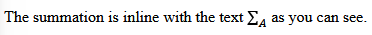

# Nordic Guidelines for Mathematical Content in HTML Files, Using MathML

## Introduction

This guidelines document is a joint effort between the (mostly) Nordic agencies dedicated to providing accessible literature in different formats – e.g. talking books, braille, and accessible e-books – to children and adults with various reading impairments or special needs. The participating organisations are [Celia](https://www.celia.fi/), [HBS](https://hbs.is/), [MTM](https://mtm.se), [NB](https://www.nb.no/), [Nota](https://nota.dk/), [SBS](https://www.sbs.ch/), [SPSM](https://www.spsm.se/), and [Statped](http://statped.no/).

Making book content accessible starts in well-structured and granular semantic markup using available markup and accessibility standards. When it comes to mathematics, the quality of the markup is essential in order for assistive technology to be able to correctly and unambiguously convey the information to the reader. It is not enough that the visual representation of a mathematical expression looks correct, the structure of the expression needs to be correctly expressed in the markup. The purpose of this document is to give further guidance in how to properly construct mathematical expressions that will give any user a correct understanding of the expression.

The basis of this document is the [MathML Core specification](https://www.w3.org/TR/mathml-core/). The aim is to provide a better understanding of how to use the MathML standard in the context of the services provided by the Nordic Agencies. The target audience of the document is mainly the Nordic agencies’ contracted EPUB 3 suppliers, but the guidelines will also be used by staff at the Nordic agencies, other vendors and interested parties, etc. Note that this document is not a beginner's introduction to MathML. A certain familiarity with the format is required, as well as a good understanding of basic mathematics.

## When To Use MathML <!--- maybe change wording later -->

As a general rule, every mathematical or scientific expression that can't be rendered with standard HTML must be captured as MathML, whereas things that can be rendered with standard HTML, like numbers, units, single Unicode characters and even simple arithmetic expressions, should be captured as HTML. However, there may be a valid point to use MathML a bit more extensively in some cases, especially in STEM content.    

### Numbers

Plain numbers, with or without decimal points or commas, are not necessary to mark up with MathML markup. They are required to be captured as plain text, formatted as in the source material. Points, commas, spaces etc. must be preserved.

### Numbers With Units

In general, numbers with attached units do not require MathML markup. The units should in most cases be captured as plain text using Unicode for any Greek symbols and `<sup>` for any exponents. However, in STEM content the Ordering Agencies may require MathML markup in order for text-to-speech output to be consistent throughout the content.

### Single Variables or Symbols

Single occurrences of variables, normally displayed in italics, constants or other symbols do not require MathML markup. They can in most cases be captured as plain text using the proper characters or Unicode symbols. If they are displayed in italics in the source material they should be styled accordingly, using the standard HTML elements.

### Simple Arithmetic Expressions in Linear Form

Mathematical expressions, such as calculations, functions, equations etc., are in general required to be marked up using MathML. However, if there are one or a few isolated simple expressions in a non-STEM context, they may be captured as plain text as long as the expressions are linear and just simple arithmetic expressions such as "1 + 1 = 2" or "3 - 1 = 2". Anything more complex or containing non-standard characters or symbols is required to be captured as MathML.

### Chemistry

MathML markup is required to be used for chemistry content in general. However, if the source material contains occasional occurrences of chemical substances written like CO<sub>2</sub> or H<sub>2</sub>O, and no other type of chemistry notation, these can be captured using standard HTML. If MathML is used for other types of chemistry notation, then MathML must be used for all chemistry content in order to ensure a consistent output for the reader. How to mark up chemistry using MathML is explained here: [Chemistry](#chemistry-in-mathml).

## MathML Fundamentals

### The Top-Level `<math>` Element

The `<math>` element is required to enclose all instances of MathML. It has several possible attributes, most of which are irrelevant in the Nordic production of accessible books. The relevant attributes are explained in the following subsections.

#### Namespace

The `<math>` element should use the namespace `http://www.w3.org/1998/Math/MathML`. This namespace is essential for ensuring that the MathML content is correctly interpreted by browsers and other tools that process MathML. To use this namespace, include it in the xmlns attribute: `<math xmlns="http://www.w3.org/1998/Math/MathML">`.

Declaring the namespace in the `<math>` element replaces the deprecated practice of declaring the namespace globally for the document and using the prefix `m:` in all MathML elements.

#### MathML `alttext` and `altimg` attributes

Don't use either of the attributes. The support for the attributes is not good, while support for MathML has improved.

<!-- Sami: I didn't have the heart to straight up delete this if we want to return to discussing this, so it is just commented out.

A `<math>` element has two different alt-attributes:
1. `alttext`
2. `altimg`.

The attribute `alttext` is used to provide an **alternative text** fallback for mathematical content when a reading system doesn't support MathML markup. Usually it is ASCIIMath or LaTeX as these formats are well known in STEM subjects. The Ordering Agency may decide which kind of content should be in the `alttext` attribute.

The attribute `altimg` is used to provide an **alternative image** fallback for mathematical content. Usually this is just a screenshot of the rendered equation. It should be used with caution, since MathML Core does not support the `altimg` attribute. It is also only a visual fallback, because you can't provide an alternative text for the fallback image. The Ordering Agency may decide if the attribute is used. -->

#### Block vs Inline

Mathematical expressions can appear either inline, as part of an ongoing sentence or paragraph, or as a stand-alone block, separate from the surrounding text. This is required to be correctly reflected in the MathML markup. The way in which a math expression is visually rendered is controlled by the `display` attribute of the `<math>` element. When the value of this attribute is set to `block`, the expression will be visually rendered as a separate block. The value `inline` will render the math expression as part of the paragraph it occurs in. Note that the default value of the `display` attribute is `inline`, meaning that it doesn't need to be declared for inline math.

It is important to separate the visual rendering from the structural markup properties of the `<math>` element. Setting `display="block"` doesn't make the `<math>` element into a block element from a structural stand-point. In fact, in order to maintain consistency of which content model the content of the `<math>` element falls into, the `<math>` element must never be placed as a stand-alone block element. Even though, formally, it can be a block element of its own, it is required here to always place it within a paragraph element or something equivalent. Either a separate `<p>` for just the expression, or within an element containing surrounding text.

Also note that even if a math expression is displayed as a separate block in the source material, and thus must have `display` set to `block`, it may still be part of an ongoing sentence, and must therefore not break this ongoing paragraph.

Here are a couple of examples:

```html
<p>Text preceding a stand-alone block of math content.</p>
<p>
<math display="block">
  <mrow>
    <mi>a</mi>
    <mo>+</mo>
    <mi>b</mi>
    <mo>=</mo>
    <mi>c</mi>
  </mrow>
</math>
</p>
```

which will render

Text preceding a stand-alone block of math content.
```math
a + b = c
```

```html
<p>Here is an inline equation:
<math>
  <mi>x</mi>
  <mo>=</mo>
  <mn>5</mn>
</math>.</p>
```

This will display in the following manner:

Here is an inline equation: $x = 5$.

For inline math, be careful to preserve whitespace around the expression. Compare the two following examples:

1. The variable`<math>x</math>`is defined to be 5.
2. The variable `<math>x</math>` is defined to be 5.

In example 1, the spaces around the math expression are missing, which will affect the visual rendering. It should remain the same as in the original title.

### Semantics and Annotations

MathML expressions can be provided with annotations in various forms. In order to associate an expression with an annotation the expression itself must be wrapped in a `<semantics>` element, placed as the first child element of the `<math>` element.  Subsequent `<annotation>` or `<annotation-xml>` elements then contain the annotation. This markup must not be used unless specific instructions are given by the Ordering Agency. In general, none of the `<semantics>`, `<annotation>` or `<annotation-xml>` elements are to be used.  

### Presentation vs Content MathML

The distinction between Presentation MathML and Content MathML lies in their purpose and how they represent mathematical expressions. Presentation MathML is generally required in production for simplicity. Content MathML, or a combined markup, should only be used if specific instructions to do so are given by the Ordering Agency.

#### Presentation MathML

Purpose: This focuses on how the math should be visually displayed, i.e., the presentation or formatting of the math. It defines how the symbols, operators, and structures should appear on the screen or in print.

Structure: It's more concerned with the layout and appearance, such as how equations are aligned, how fractions are displayed, the spacing between symbols, and other visual aspects.

Ideal for rendering math on a web page or document where the primary concern is how the equation looks visually (like in textbooks or websites).

#### Content MathML

Purpose: This focuses on the meaning and structure of the mathematical expression, rather than how it is displayed. Content MathML defines the logical or semantic structure of the math, making it easier for machines (like computers or search engines) to understand and process the equation.

Structure: It is more abstract and focuses on the underlying mathematical concepts - like functions, variables, and operations - without worrying about visual appearance.

Ideal for situations where the math needs to be processed, interpreted, or manipulated programmatically for symbolic computation or automated theorem proving, for instance).

#### Combined markup

In practice, both types of MathML can be used together. A typical use case involves combining Presentation MathML for the visual rendering of an equation on the web, while Content MathML might be used behind the scenes to represent the mathematical logic for processing or to enhance accessibility (e.g., for screen readers). The presentation and content tags can be used in the same math element.

For example, a webpage might use Presentation MathML to display an equation visually, while also using Content MathML to allow tools to interpret and interact with that equation programmatically.

## Basic Markup Structure

### Token Elements

#### `<mn>`

The `<mn>` element is used to mark up all kinds of numeric characters. This also includes decimal and thousand separators. They shouldn't be mark up separate from the number.

There are different ways to mark up the decimal and thousand separators based on the publication. Follow the mark up of the publication unless specifically told otherwise by the Ordering Agency.


For example using 
- comma as a decimal separator: `<mn>3,14</mn>`
- non-breaking space as a thousand separator: `<mn>89&nbsp;000</mn>`
- period as a decimal separator: `<mn>2.74</mn>`
- comma as a thousand separator: `<mn>19,050</mn>`.

#### `<mo>` for operators, fences, separators or accents

The `<mo>` element is used to denote operators. The definition of an operator is loose and it can mean the actual mathematical operators plus (+), minus (&minus;), times (&centerdot;) and divided by (/).

In MathML it also means different parentheses. For example the parenthesis `<mo>(</mo>` and curly bracket `<mo>{</mo>`. Note that the element `<mfenced>` is deprecated and may not be used!

The same character can be used in a different meaning based on the context. For example the comma can be part of a number, but in a sequence the comma is an operator.

For example the sequence {1,2,3,...} written in MathML:
```html
<mo>{</mo>
<mn>1</mn>
<mo>,</mo>
<mn>2</mn>
<mo>,</mo>
<mn>3</mn>
<mi>...</mi>
<mo>}</mo>
```

Some characters are written with accents. Such as the average <math><mover><mi>x</mi><mo>&#8254;</mo></mover></math> (read as "x bar"). Here the accent "bar" is also an operator. MathML code:

```html
<mover>
    <mi>x</mi>
    <mo>&#8254;</mo>
</mover>
```

More about the usage of `<mover>` later on.

#### `<mi>` element for variables, functions and units

The `<mi>` element is used to denote functions, variables, units and other identifiers. An identifier can be just one letter of symbol such as a variable `<mi>α</mi>` or `<mi>x</mi>`.

Functions and function names are identifiers: `<mi>tan</mi>`, `<mi>sin</mi>` or `<mi>log</mi>`.

Units are identifiers. For example the meter `<mi>m</mi>` or second `<mi>s</mi>`. When units are written using multiple letters, you should mark them up as a single element: `<mi>Nm</mi>`. Depending on the layout of the unit, you have to use other MathML elements to markup a single unit such as meters per second to the second: 

```html
<mfrac>
    <mi>m</mi>
    <msup>
        <mi>s</mi>
        <mn>2</mn>
    </msup>
</mfrac>
```

Which renders as <mfrac>
    <mi>m</mi>
    <msup>
        <mi>s</mi>
        <mn>2</mn>
    </msup>
</mfrac>.

The ellipsis or three dots &#x2026; is also an identifier `<mi>&#x2026;</mi>`.

#### Text inside math expressions `<mtext>`

The `<mtext>` element is used to mark up text that doesn't have any explicit mathematical meaning. It can be used for notation, commentary or for examples in study books.

Use as little of `<mtext>` as possible. When it is possible to use plain HTML for text, use it.

Here is an example when `<mtext>` has been used in the wrong way:

```html
<p>After this lemma 
    <math>[mathematical expression] 
        <mtext> we can see that this holds for </mtext>
    [more mathematical expressions]
    </math>
and it happens so.</p>
```

The explanatory text in between the math expressions is regular text and part of the paragraph and should instead be written like this:

```html
<p>After this lemma 
    <math>[mathematical expression]</math>
we can see that this holds for
    <math>[more mathematical expression]</math>
and it happens so.</p>
```

It should only be used in places where the visual rendering requires it. 

Examples of this are in tabular math, such as equations solving, and what is seen often in study books: $\frac{\text{numerator}}{\text{denominator}}$.

```html
<math>
    <mfrac>
        <mtext>numerator</mtext>
        <mtext>denominator</mtext>
    </mfrac>
</math>
```

When a notation has written words, then you should use `<mtext>` as well. For example in indeces $g_{weight}$. This would be marked up as

```html
<math>
    <msub>
        <mi>g</mi>
        <mtext>weight</mtext>
    </msub>
</math>
```

Note that some automatic MathML markup engines causes text in equations to be captured with each letter inside its own `<mi>` element. Please avoid this and use `<mtext>` instead as examplified above.

The attribute `style` can be used to format text in the `<mtext>` element to reflect the source. Also make sure to include whitespace when necessary inside the `<mtext>` markup so that the display matches the source.

##### Punctuation

Since mathematical expressions are usually part of sentences (as is described in block vs inline) a punctuation mark such as a period, comma, exclamation mark, question mark and so on can be at the end of a mathematical expression.

For the visual layout of the mathematical expression to be correct, the punctuation has to be included inside the `<math>` element. Example of a sentence ending mathematical expression:

```html
<p>
   This can be seen from the quadratic formula
   <math xmlns="http://www.w3.org/1998/Math/MathML" display="block">
      <mi>x</mi>
      <mo>=</mo>
      <mfrac>
         <mrow>
            <mrow>
               <mo>−</mo>
               <mi>b</mi>
            </mrow>
            <mo>±</mo>
            <msqrt>
               <mrow>
                  <msup>
                     <mi>b</mi>
                     <mn>2</mn>
                  </msup>
                  <mrow>
                     <mo>−</mo>
                     <mn>4</mn>
                     <mo>⁢</mo>
                     <mi>a</mi>
                     <mo>⁢</mo>
                     <mi>c</mi>
                  </mrow>
               </mrow>
            </msqrt>
         </mrow>
         <mrow>
            <mn>2</mn>
            <mo>⁢</mo>
            <mi>a</mi>
         </mrow>
      </mfrac>
      <mtext>.</mtext>
   </math>
</p>
```

**Note!** If the mathematical expression also ends in text, the punctuation should be wrapped in its own `<mtext>` element and be a sibling to the other text node. Example mark up for this:

```html
<p>
   If we have an equation such as
   <math display="block">
      <mo>(</mo>
      <mi>a</mi>
      <mo>
         ∘<!-- ∘ -->
      </mo>
      <mi>b</mi>
      <mo>)</mo>
      <mo>
         ∘<!-- ∘ -->
      </mo>
      <mi>c</mi>
      <mo>=</mo>
      <mi>a</mi>
      <mo>
         ∘<!-- ∘ -->
      </mo>
      <mo>(</mo>
      <mi>b</mi>
      <mo>
         ∘<!-- ∘ -->
      </mo>
      <mi>c</mi>
      <mo>)</mo>
      <mspace width="5em"></mspace>
      <mtext>(1.3)</mtext>
      <mtext>.</mtext>
   </math>
</p>


```

### General Layout Schemata

#### Grouping mathematical expressions with `<mrow>`

The `<mrow>` element is used to group mathematical expressions and parts of expressions. This is important when it comes to other elements, which can only have two children. Example of this would be the `<mfrac>` element:

```html
<math>
    <mrow>
      <mo>(</mo>
      <mfrac>
        <mrow>
          <mn>1</mn>
          <mo>+</mo>
          <mfrac>
            <mn>2</mn>
            <mn>3</mn>
          </mfrac>
        </mrow>
        <mn>4</mn>
      </mfrac>
      <mo>)</mo>
    </mrow>
</math>
```

The `<mrow>` has to be used to group the whole numerator expression, so that it is properly part of the `<mfrac>`.

The `<mrow>` element is also used by the browser or reading software to render mathematics correctly. For example in the matrix markup, it is the reason the parentheses stretch to the sides of the matrix.

Example of rendering a determinant when the `<mrow>` has been used correctly:


Exampe of rendering a determinant when the `<mrow>` hasn't been used at all:


#### Fractions, binomials and other similar layouts with `<mfrac>`

The element `<mfrac>` is used for fractions, but also for other mathematical expressions that have the same visual layout such as the binomial.

Example mark up for a fraction:
```html
<math>
    <mfrac>
        <mn>5</mn>
        <mn>2</mn>
    </mfrac>
</math>
```

The fraction rendered: <math>
    <mfrac>
        <mn>5</mn>
        <mn>2</mn>
    </mfrac>
</math>.


Example mark up for a binomial:
```html
<math>
  <mrow>
    <mo>(</mo>
    <mfrac linethickness="0">
      <mi>n</mi>
      <mi>k</mi>
    </mfrac>
    <mo>)</mo>
  </mrow>
</math>
```

The binomial rendered: <math>
  <mrow>
    <mo>(</mo>
    <mfrac linethickness="0">
      <mi>n</mi>
      <mi>k</mi>
    </mfrac>
    <mo>)</mo>
  </mrow>
</math>.

**Notice** that for the binomial to be rendered correctly you need to use
- the `<mrow>` to group the expression
- the `<mfrac>` element with the attribute `linethickness="0"`.

The `linethickness="0"` attribute doesn't render the horizontal line for fractions, so the visual rendering is correct. It is also used by assistive technology to differentiate fractions from binomials.


#### `<msqrt>` and `<mroot>`

#### `<mpadded>` and `<mspace>` <!--- test with MathCAT first -->

### Script and Limit Schemata


#### Subscripts and Superscripts, `<msub>`, `<msup>`, `<msubsup>`

Superscript notation is marked up using `<msup>`. The first child element is the base, and the second child element is the superscript. For example, $x^2$ is marked up as follows:

```html
<math>
    <msup>
      <mi>x</mi>
      <mn>2</mn>
    </msup>
</math>
```

Similarly, subscript notation is marked up using `<msub>`. The first child element is the base, and the second child element is the subscript. For example, $x_i$ is marked up as follows:

```html
<math>
    <msub>
      <mi>x</mi>
      <mi>i</mi>
    </msub>
</math>
```

For marking up both super- and subscript on the same base, `<msubsup>` is used. The first child element is the base, the second child element is the subscript, and the third child element is the superscript. For example, $x_i^2$ is marked up as follows:

```html
<math>
    <msubsup>
      <mi>x</mi>
      <mi>i</mi>
      <mi>2</mi>
    </msubsup>
</math>
```

When a sub- or superscript contains multiple elements they are grouped together using `<mrow>`. For example, $x^{a+b}$ is marked up as follows:

```html
<math>
    <msup>
      <mi>x</mi>
      <mrow>
        <mi>a</mi>
        <mo>+</mo>
        <mi>b</mi>
      </mrow>
    </msup>
</math>
```

The same principle applies for `<msubsup>`. Note also that the base can be grouped together using `<mrow>`. For example, $(x+y)^{a+b}_i$ is marked up as follows:

```html
<math>
    <msubsup>
      <mrow>
        <mo>(</mo>
        <mi>x</mi>
        <mo>+</mo>
        <mi>y</mi>
        <mo>)</mo>
      </mrow>
      <mi>x</mi>
      <mrow>
        <mi>a</mi>
        <mo>+</mo>
        <mi>b</mi>
      </mrow>
    </msubsup>
</math>
```

#### Underscripts and Overscripts, `<munder>`, `<mover>`, `<munderover>`

Underscript notation is marked up using the element `<munder>`. The first child element is the base, and the second child element is the underscript. For example, a summation with a lower limit such as $\sum\limits_{i=1}$ is marked up as follows:

```html
<math>
    <munder>
      <mo>∑</mo>
      <mrow>
        <mi>i</mi>
        <mo>=</mo>
        <mi>1</mi>
      </mrow>
    </munder>
</math>
```

Overscript notation is marked up using the element `<mover>`. The first child element is the base, and the second child element is the overscript. For example, a vector with an arrow above it ($\vec{x}$) is marked up as follows:

```html
<math>
  <mover>
    <mi>x</mi>
    <mo>→</mo>
  </mover>
</math>
```

When both an underscript and overscript are needed, the element `<munderover>` is used. The first child element is the base, the second is the underscript and the third is the overscript. For example, an integral with lower and upper limits like $\int_a^b$ is marked up as follows:

```html
<math>
    <munderover>
      <mo>∫</mo>
      <mi>a</mi>
      <mi>b</mi>
    </munderover>
</math>
```

Note that `<mrow>` can be used to group together base, underscript or overscript respectively, as explained in [Subscripts and Superscripts](#Subscripts-and-Superscripts,-`<msub>`,-`<msup>`,-`<msubsup>`).

#### Prescripts and Postscripts, `<mmultiscripts>`

Sometimes multiple prescripts and postscripts are attached to the same base, e.g. in tensor notation. To mark up this, the element `<mmultiscripts>` is used.  The `<mmultiscripts>` element contains the base element followed by pairs of subscript and superscript elements. The example of $_{qs}^{t}A_{m}^{np}$ below explains how. <!-- HELP I can't get this to render! /Tim-->

```html
<math>
  <mmultiscripts>
    <mn>A</mn>
    <mn>m</mn>
    <mn>n</mn>
    <mrow></mrow>
    <mn>p</mn>
    <mprescripts/>
    <mn>q</mn>
    <mrow></mrow>
    <mn>s</mn>
    <mn>t</mn>
  </mmultiscripts>
</math>
```

In the example, A is the base`<mprescripts>` marks where the prescripts begin. 
- `<mi>A</mi>` is the base element.
- `<mi>m</mi>` is a postscript subscript.
- `<mi>n</mi>` and `<mi>p</mi>` are postscript superscripts.
- `<mrow></mrow>` marks empty sub- or superscript positions.
- `<mprescripts/>` indicates the start of prescripts.
- `<mi>q</mi>` and `<mi>s</mi>` are postscript subscripts.
- `<mi>t</mi>` is a postscript superscript.

### Tabular Math

Math can be presented in a table-like structure and MathML has its own markup to handle this.

#### When to use the regular HTML `<table>`

Use a HTML `<table>` when it's possible. It should be used with presenting data and when MathML isn't needed (as per section When To Use MathML). Example of a table where HTML `<table>` should be used:


```html
<table>
    <tr>
        <td>1</td>
        <td>2</td>
        <td>3</td>
    </tr>
    <tr>
        <td>4</td>
        <td>5</td>
        <td>6</td>
    </tr>
    <tr>
        <td>7</td>
        <td>8</td>
        <td>9</td>
    </tr>
</table>
```

You can mix HTML and MathML markup inside the HTML `<table>`. Example:


```html
<table>
    <tr>
    <td>
        <math>
            <mfrac>
                <mn>2</mn>
                <mi>x</mi>
            </mfrac>
        </math>
    </td>
    <td>2</td>
    <td>3</td>
    </tr>
    <tr>
    <td>4</td>
    <td>5</td>
    <td>
        <math>
            <mfrac>
                <mn>5</mn>
                <mrow>
                    <mn>2</mn>
                    <mo>&#x2062;</mo>
                    <mi>x</mi>
                </mrow>
            </mfrac>
        </math>
    </td>
    </tr>
    <tr>
    <td>7</td>
    <td>8</td>
    <td>9</td>
    </tr>
</table>
```

### When to use the MathML `<mtable>`

If there is mathematical notation that can't be achieved with just an HTML `<table>`, then use MathML `<mtable>`.

Many times any mathematical notation, that spans multiple lines, should be marked up with the MathML `<mtable>`.

Some use cases for tabular math
- matrices
- determinants
- piecewise functions
- equation solving notation
- systems of equations.

Inside the `<mtable>` element there are also the row element `<mtr>` and the (data) cell element `<mtd>`. They are equivalent to the HTML `<table>` element's row `<tr>` and cell `<td>` elements.

Example of the rendering and markup for a determinant:


```html
<math>
    <mrow>
        <mo>|</mo>
        <mtable>
            <mtr>
                <mtd>
                    <mn>2</mn>
                </mtd>
                <mtd>
                    <mn>1</mn>
                </mtd>
            </mtr>
            <mtr>
                <mtd>
                    <mn>7</mn>
                </mtd>
                <mtd>
                    <mn>5</mn>
                </mtd>
            </mtr>
        </mtable>
        <mo>|</mo>
    </mrow>
</math>
```

Example of a piecewise function. It is important that the different expressions line up with each other. Here is the rendering and markup:


```html
<math>
    <mi>f</mi>
    <mrow>
      <mo>(</mo>
      <mi>x</mi>
      <mo>)</mo>
    </mrow>
    <mo>=</mo>
    <mrow>
      <mo>{</mo>
      <mtable>
        <mtr>
            <mtd>
                <mo>&#x2212;</mo>
                <mn>1</mn>
            </mtd>
            <mtd>
                <mtext>if</mtext>
            </mtd>
            <mtd>
                <mi>x</mi>
                <mo>&lt;</mo>
                <mn>0</mn>
            </mtd>
        </mtr>
        <mtr>
            <mtd>
                <mn>0</mn>
            </mtd>
            <mtd>
                <mtext>if</mtext>
            </mtd>
            <mtd>
                <mi>x</mi>
                <mo>=</mo>
                <mn>0</mn>
            </mtd>
        </mtr>
        <mtr>
            <mtd>
                <mn>1</mn>
            </mtd>
            <mtd>
                <mtext>if</mtext>
            </mtd>
            <mtd>
                <mi>x</mi>
                <mo>&gt;</mo>
                <mn>0</mn>
            </mtd>
        </mtr>
      </mtable>
    </mrow>
</math>
```

Some notation might look like tabular math, but isn't. Some possibilities for confusion:
- absolute value $|x+2|$
- intervals $[5,15]$.

If there is any confusion, you should reach out to the Ordering Agency.

#### Attributes `rowspan` and `columnspan`

If the rows and columns need to be spanned across multiple cells, use the `rowspan` and `columnspan` attributes. They are equivalent to the HTML attributes `rowspan` and `colspan`.

Notice that `columnspan` is written this way, because of backwards compatability for MathML 3.

### Labeling and referencing equations

It is common to label equations and then reference these equations later on in mathematical text.

Example markup for a block equation with a label:

```html
<math display="block" aria-labelledby="label-1-3" id="eq-1-3">
    <mo>(</mo>
    <mi>a</mi>
    <mo>∘<!-- ∘ --></mo>
    <mi>b</mi>
    <mo>)</mo>
    <mo>∘<!-- ∘ --></mo>
    <mi>c</mi>
    <mo>=</mo>
    <mi>a</mi>
    <mo>∘<!-- ∘ --></mo>
    <mo>(</mo>
    <mi>b</mi>
    <mo>∘<!-- ∘ --></mo>
    <mi>c</mi>
    <mo>)</mo>
    <mspace width="5em"/>
    <mtext id="label-1-3">(1.3)</mtext>
</math>
```

The `<math>` element should have the attributes
- `aria-labelledby`, where referenced `id` is the `<mtext>` **label's** `id`
- `id` that is based on the `<mtext>` label.

The label of the equation is in the `<mtext>` element and the `<mtext>` element has an `id` that is based on the `<mtext>` content. Use `<mspace>` for spacing between the equation and the `<mtext>`.

**Note** that the element `<mlabeledtr>` is not allowed to use for labeling.

When the equation is later referenced, use the ID of the `<math>` element to link back to the equation. Also use the `role="doc-backlink"` attribute. Example markup of referencing the equation:

```html
<p>Then it is derived from the equation <a role="doc-backlink" href="#eq-1-3">(1.3)</a>.</p>
```

### Footnotes in mathematical expressions

If there are footnotes with the mathematical expressions, then try to write the footnote outside of the `<math>` element.

Example:
```html
<math>
    [mathematical expression]
</math>
<p>This is a footnote about the mathematical expression.</p>
```

If this can't be avoided, use `<mtext>` to mark up the footnote inside `<math>` element.

```html
<math>
    [mathematical expression]
    <mtext>This is a footnote about the mathematical expression.</mtext>
</math>
```

The ordering agency may have more instruction for the footnotes in the editing instructions.

## Context-Based Applications <!--- maybe change wording later -->

### Large operators

Large operators are such as summation $∑$, product $Π$ or integral $∫$. These are marked up as mathematical operators `<mo>`. These operators are rendered differently based on when they are written in inline, block or inline-block.

The rendering of the operator should follow how it is written in the original title, unless specified otherwise by the Ordering agency.

Examples of different markup options below.

#### Inline

When the large operator is written inline with the other text, you don't have to use any other attributes. Example:


Mark up:
```html
<p>The summation is inline with the text 
    <math>
        <munder>
            <mo>∑</mo>
            <mi>A</mi>
        </munder>
    </math> as you can see.
</p>
```

#### Block

The rendering of the large operator changes when it is displayed as a block element with the attribute `display="block"`. Example:


```html
<p>Here is an example of a summation as a block element: 
    <math display="block">
        <munder>
          <mo>∑</mo>
          <mi>A</mi>
        </munder>
    </math>
</p>
```

#### Inline-block

When the operator should be rendered inline, but as block element, it can be done by using the attribute `displaystyle="true"` on the encompassing element (such as `<munder>`). Example:


```html
<p>The summation is inline with the text 
    <math>
        <munder displaystyle="true">
            <mo>∑</mo>
            <mi>A</mi>
        </munder>
    </math> as you can see.
</p>
```

### Invisible Operators

Insivible operators are used when the meaning of an equation would be ambigious. For example $a(x+1)$ might be the function $a$ of $x+1$ or then it could be the multiplication between $a$ and $(x+1)$.

Using invisible operators makes the markup unambigious:

- insivible multiplication: `&#x2062;`
- invisible function application: `&#x2061;`
- invisible plus: `&#x2064;`
- invisible comma: `&#x2063;`

(Can be deleted later) Source: [MathML 4 "Invisible operators"](https://www.w3.org/TR/mathml4/#presm_invisibleops).

### Systems of Equations

Systems of equations are tabular math. See the section Tabular math for more information. 

Example rendering and markup of a pair of equations:


```html
<math>
    <mrow>
        <mo>{</mo>
        <mtable>
            <mtr>
                <mtd> 
                    <mrow> 
                        <mi>x</mi>
                        <mo>+</mo>
                        <mi>y</mi>
                    </mrow> 
                </mtd>
                <mtd>
                    <mo>=</mo>
                </mtd>
                <mtd>
                    <mn>7</mn>
                </mtd>
            </mtr>
            <mtr>
                <mtd>
                    <mrow>
                        <mn>2</mn>
                        <mi>x</mi>
                        <mo>+</mo>
                        <mn>3</mn>
                        <mi>y</mi>
                    </mrow>
                </mtd>
                <mtd>
                    <mo>=</mo>
                </mtd>
                <mtd>
                    <mn>17</mn>
                </mtd>
            </mtr>
        </mtable>
    </mrow>
</math>
```

### Equation solving notation

Equation solving notation is tabular math. See the section Tabular math for more information.

The notation and layout is very similar to systems of equations, but equation solving usually has additional commentary about the equation in question.

Example of rendering and mark up of equation solving notation:


```html
<math>
    <mtable>
        <mtr>
            <mtd> 
                <mrow>
                    <mn>2</mn
                    <mo>&#x2062;</mo>
                    <mi>x</mi>
                    <mo>+3</mo>
                </mrow> 
            </mtd>
            <mtd>
                <mo>=</mo>
            </mtd>
            <mtd>
                <mn>7</mn>
            </mtd>
            <mtd>
                <mrow>
                    <mo>|</mo>
                    <mo>|</mo>
                </mrow>
                <mo>&#x2212;</mo>
                <mn>3</mn>
        </mtr>
        <mtr>
            <mtd>
                <mrow>
                    <mn>2</mn>
                    <mi>x</mi>
                </mrow>
            </mtd>
            <mtd>
                <mo>=</mo>
            </mtd>
            <mtd>
                <mn>7</mn>
                <mo>&#x2212;</mo>
                <mn>3</mn>
            </mtd>
            <mtd><--- Empty cell ---></mtd>
        </mtr>
    </mtable>
</math>
```

Notice that there is an empty cell underneath the $-3$ notation. This is so that the table cells line up properly.

This kind of mark up can have commentary text instead of the mathematical notation. This should be marked up inside the MathML `<mtable>` as well.

Example of the rendering and mark up of equation solving with commentary text:


```html
<math>
    <mtable>
        <mtr>
            <mtd> 
                <mrow>
                    <mn>2</mn
                    <mo>&#x2062;</mo>
                    <mi>x</mi>
                    <mo>+3</mo>
                </mrow> 
            </mtd>
            <mtd>
                <mo>=</mo>
            </mtd>
            <mtd>
                <mn>7</mn>
            </mtd>
            <mtd>
                <mtext>(substract 3 from both sides)</mtext>
        </mtr>
        <mtr>
            <mtd>
                <mrow>
                    <mn>2</mn>
                    <mi>x</mi>
                </mrow>
            </mtd>
            <mtd>
                <mo>=</mo>
            </mtd>
            <mtd>
                <mn>7</mn>
                <mo>&#x2212;</mo>
                <mn>3</mn>
            </mtd>
            <mtd><--- Empty cell ---></mtd>
        </mtr>
    </mtable>
</math>
```

### When to use images of mathematical content

There are cases when all of the mathematical content can't be captured with just MathML. Example of such notation in a study book that can't be replicated with just MathML:


Here the arrow and text pointing to the first column can't be replicated. In these cases capture the mathematical content as an image and markup as an image description below it. Capture the matrix in MathML inside the image description and extract the text.

Use the markup that is specified in the [Nordic Guidelines for Production of Accessible EPUB 3 section "text extraction from images"](https://github.com/nlbdev/nordic-accessible-epub-guidelines/blob/main/guidelines/guidelines.md#text-extraction-from-images).

Example markup based on this:

```html
<figure class="image">
	
	<aside class="fig-desc" id="desc011">
		<p>
            <math>...</math>
        </p>
        <p>Leftmost nonzero columns.</p>
	</aside>
</figure>
```

**Note** that the `alt` attribute has the value `equation`.

### Chemistry {#chemistry-in-mathml} 
<!-- I'm doing this ID thing wrong, aren't I? /Tim -->
=======
### Chemistry in MathML

To mark up chemistry in MathML, follow these general principles.

- Use `<mi>` to mark up each element in molecules. For example, $\text{NaCl}$ would be marked up as `<mi>Na</mi><mi>Cl</mi>`.
- Use `<msub>` and `<msup>` to mark up subscripts and superscripts, respectively. For example, to represent $\text{H}_2\text{O}$:
```html
<math>
  <mrow>
    <msub>
      <mi>H</mi>
      <mn>2</mn>
    </msub>
    <mi>O</mi>
  </mrow>
</math>
```
- Use `<mmultiscripts>` to mark up isotopes. For example, to represent $^{14}\text{C}$:
```html
<math>
  <mmultiscripts>
    <mn>C</mn>
    <mrow></mrow>
    <mrow></mrow>
    <mprescripts/>
    <mrow></mrow>
    <mn>14</mn>
  </mmultiscripts>
</math>
```
- Use `<mo>` for operators like arrows. For example, to represent a chemical reaction like $H_2 + O_2 \rightarrow H_2O$:
```html
<math>
  <mrow>
    <msub>
      <mi>H</mi>
      <mn>2</mn>
    </msub>
    <mo>+</mo>
    <msub>
      <mi>O</mi>
      <mn>2</mn>
    </msub>
    <mo>&#x2192;</mo>
    <msub>
      <mi>H</mi>
      <mn>2</mn>
    </msub>
    <mi>O</mi>
  </mrow>
</math>
```

<!--- these are examples, must fill section with more -->

## Special Content Requirements

Some content requires extra attention. A few recurring cases are listed below.

### Special Characters

Using the correct Unicode characters is essential for a screen reader or braille display to be able to do its job. Even if characters are visually similar, they will be read or displayed wrong if the OCR assigns the wrong Unicode entities.

A few examples of visually similar characters:
* Greek letter γ and latin y.
* Greek letter ρ and latin p.
* Greek letter ω and latin w.
* ′ (prime) and ' (apostrophe).
* − (minus) and - (hyphen).
* ⅆ for derivative and ordinary d.

Please refer to a [Unicode character table](https://symbl.cc/en/unicode-table/). If in doubt about which characters to use, please contact the ordering agency.

### Special markup

There are some country-specific mathematical notation that should be taken into account in the MathML markup.

#### Multiplication and division of fractions

This notation means that the numerator and the denominator are multiplied by the same number:


In MathML it is marked up as
```html
<math>
<mmultiscripts>
	<mfrac>
    <mn>3</mn>
    <mn>5</mn>
    </mfrac> <!-- base expression -->
    <mrow></mrow> <!-- empty post-sub-script -->
    <mrow></mrow> <!-- empty post-sup-script -->
    <mprescripts/>
    <mrow></mrow>  <!-- empty pre-sub-script -->
    <mrow>
      <mn>2</mn>
      <mo>)</mo>
    </mrow> <!-- pre-sup-script -->
</mmultiscripts>
</math>
```

Then the respective division notation:


Its mark up in MathML:
```html
<math>
<mmultiscripts>
	<mfrac>
    <mn>6</mn>
    <mn>9</mn>
    </mfrac> <!-- base expression -->
    <mrow></mrow> <!-- empty post-sub-script -->
    <mrow>
      <mo>(</mo>
      <mn>3</mn>
    </mrow> <!-- post-sup-script -->
    <mprescripts/>
    <mrow></mrow> <!-- empty pre-sub-script -->
    <mrow></mrow> <!-- empty pre-sup-script -->
</mmultiscripts>
</math>
```

<!-- Commenting this out, since I'm not totally sure how to implement this /Sami

#### Substitution in integral notation

A slash is used in some countries to denote substitution:


Use the Unicode character ⧸ ("big solidus", U+29F8) for the slash in the integral substitution. It is also important to have the attribute `intent="substitution"`. The attribute is language-specific, so the ordering agency will specify, which word to use instead of 'substitution'.  -->

### Typefaces and style

The MathML core specification supports a multitude of options for adjusting the typeset, e.g. the `<mstyle>` element or making changes in the stylesheet. Please **do not use** any of these since conflicts may arise between the markup and the user agencies' own stylesheets. It is not necessary that mathematical expressions are typeset exactly as in the source. A few cases, however, need to be taken into consideration.

#### Embellishments

Lines, arrows and other embellishments on variables are often used to denote vectors or other structures which carry meaning. Therefore `<mover>`, `<munder>` or the like should be used to mark up these. For example, the vector $\overline{x}$ should be marked up as follows:

```html
<math>
  <mover>
    <mi>z</mi>
    <mo accent='false'>¯</mo>
  </mover>
</math>
```

Note that the attribute `accent` should be set to false in order to specify that the embellishment is not an accent. Avoid using the `style` attribute for these purposes as it will only renderer visually and not be noticed by a screen reader.

#### Typographical emphasis

Typeface of letters will default to italics when using MathML, therefore it is not necessary to specify this in the markup. For bold, non-italic typeface, use the attribute `mathvariant` set to bold in the corresponding `<mo>` or `<mi>` element.

### HTML Inside a Math Expression

In MathML expressions, certain characters need to be escaped to ensure they are correctly interpreted. These characters include:

- & (ampersand) which should be written as \&amp;
- \< (less than) which should be written as \&lt;
- \> (greater than) which should be written as \&gt;
- " (double quote) which should be written as \&quot;
- ' (single quote) which should be written as \&apos; (not to be confused with ′ (prime), see [Special Characters](#special-characters))

These escape sequences are necessary to avoid conflicts with the XML syntax used in MathML.

## Quality assurance

Automatic tools for MathML markup have tendencies to produce errors. A procedure for quality assurance should include searching for instances where the markup deviates from these guidelines. In addition to the Nordic EPUB validator, we recommend using [this online tool developed by Jan Martin Kvile at Statped](https://kvile.com/blind/kvalidator/). The searches can be modified by clicking the desired list item and editing the corresponding xpath query.


## Resources

* [Unicode character tables](https://symbl.cc/en/unicode-table/)
* [MathML Validator](https://kvile.com/blind/kvalidator/)
