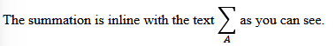

# Nordic Guidelines for Mathematical Content in HTML Files, Using MathML

## Introduction

This guidelines document is a joint effort between the (mostly) Nordic agencies dedicated to providing accessible literature in different formats – e.g. talking books, braille, and accessible e-books – to children and adults with various reading impairments or special needs. The participating organisations are [Celia](https://www.celia.fi/), [HBS](https://hbs.is/), [MTM](https://mtm.se), [NB](https://www.tibi.no/), [Nota](https://nota.dk/), [SBS](https://www.sbs.ch/), [SPSM](https://www.spsm.se/), and [Statped](http://statped.no/).

Making book content accessible starts in well-structured and granular semantic markup using available markup and accessibility standards. When it comes to mathematics, the quality of the markup is essential in order for assistive technology to be able to correctly and unambiguously convey the information to the reader. It is not enough that the visual representation of a mathematical expression looks correct, the structure of the expression needs to be correctly expressed in the markup. The purpose of this document is to give further guidance on how to properly construct mathematical expressions that will give any user a correct understanding of the expression.

The basis of this document is the [MathML Core specification](https://www.w3.org/TR/mathml-core/). The aim is to provide a better understanding of how to use the MathML standard in the context of the services provided by the Nordic Agencies. The target audience of the document is mainly the Nordic agencies’ contracted EPUB 3 suppliers, but the guidelines will also be used by staff at the Nordic agencies, other vendors and interested parties, etc. Note that this document is not a beginner's introduction to MathML. A certain familiarity with the format is required, as well as a good understanding of basic mathematics.

## When To Use MathML <!--- maybe change wording later -->

In general, all mathematics should be marked up with MathML. Even simple arithmetic expressions such as 4 − 1 = 3, should be in MathML. If a mathematical expression is part of a sentence, make sure only to mark up the mathematics with MathML. For example, in the sentence, “the price for three pairs of jeans was 90 euros (30 € × 3), and he paid for them in cash”, the mathematical expression is extra information, expressed by the parentheses. In this case the parentheses is not part of the mathematical expression and should therefore not be marked up with MathML. Only the mathematical expression inside the parentheses should be in MathML.   

### Numbers and Numbers with Units

Non-negative numbers, like 3 and 5.2, should be in plain text. If a number has a minus, like −4 or −3.1, it should be in MathML. If a number is part of a mathematical expression, it should be in MathML.

Units should be in plain text, except if there is an exponent, division or Greek letter in it. For example, "10 m" should be in plain text, while "10 m/s<sup>2</sup>" should be in MathML.

### Variables, Parameters and Greek Letters

Variables and parameters should always be marked up with MathML.

In STEM books Greek letters should always be in MathML. In these books they are variables and parameters. In non-STEM books isolated Greek letters should be in plain text. However, if they are part of an expression, like Δx, the whole expression should be marked up with MathML.

Variables, Greek letters etc. with a sign above, like $\bar{x}$ or $\hat{y}$, or with indexes, like β<sub>1</sub> or ℇ<sub>0</sub>, should always be marked up with MathML, using “mover” and “msub” respectively. Note that there are distinct characters like ŷ (U+0177), but these are not intended for mathematics and should not be used.

### Some Things That Should Be In Plain Text

Things that are not mathematics should not be marked up with MathML. Below is a list with some examples. If it is unclear whether something is mathematics or not, please ask the Ordering Agency.

- Years: “The 1950s” (English), “1950-årene” (Norwegian)
- Dates: “23.10.2013”, “23/10 - 13”
- Time periods: “1840–1845”, “June 1–June 4”
- Intervals like “7–8 children” (7 to 8 children), “90–95% of the participants voted yes”
- Numbers on journals etc: “Vi menn 1/2025”
- ISBN: “978-82-7007-515-7”
- Page numbers: “page 18–19”
- Laws and paragraphs in laws: “NOU 1991:2”, “lov 1977–06–03 nr. 57”, “§ 2–4”
- Chapters in the Bible: “2 Mos 33,15–22”
- Phone numbers, addresses
- Results: “MANU–LFC: 3–2”
- Countdown: 3-2-1

### Chemistry

MathML markup is required to be used for all chemistry content in general. However, if the source material contains occasional occurrences of chemical substances written like CO<sub>2</sub> or H<sub>2</sub>O, and no other type of chemistry notation, these can be captured using standard HTML. If MathML is used for other types of chemistry notation, then MathML must be used for all chemistry content in order to ensure a consistent output for the reader. How to mark up chemistry using MathML is explained here: [Chemistry](#chemistry-in-mathml).

## MathML Fundamentals

### The Top-Level `<math>` Element

The `<math>` element is required to enclose all instances of MathML. It has several possible attributes, most of which are irrelevant in the Nordic production of accessible books. The relevant attributes are explained in the following subsections.

#### Namespace

The `<math>` element should use the namespace `http://www.w3.org/1998/Math/MathML`. This namespace is essential for ensuring that the MathML content is correctly interpreted by browsers and other tools that process MathML. To use this namespace, include it in the xmlns attribute: `<math xmlns="http://www.w3.org/1998/Math/MathML">`.

Declaring the namespace in the `<math>` element replaces the deprecated practice of declaring the namespace globally for the document and using the prefix `m:` in all MathML elements.

#### MathML `alttext` and `altimg` attributes

Do not use either of the attributes. The support for the attributes is not good, while support for MathML has improved.

<!-- Sami: I didn't have the heart to straight up delete this if we want to return to discussing this, so it is just commented out.

A `<math>` element has two different alt-attributes:
1. `alttext`
2. `altimg`.

The attribute `alttext` is used to provide an **alternative text** fallback for mathematical content when a reading system doesn't support MathML markup. Usually it is ASCIIMath or LaTeX as these formats are well known in STEM subjects. The Ordering Agency may decide which kind of content should be in the `alttext` attribute.

The attribute `altimg` is used to provide an **alternative image** fallback for mathematical content. Usually this is just a screenshot of the rendered equation. It should be used with caution, since MathML Core does not support the `altimg` attribute. It is also only a visual fallback, because you can't provide an alternative text for the fallback image. The Ordering Agency may decide if the attribute is used. -->

<!-- Elise: To ease Sami's heartbreak, we could add:
The Ordering Agency may decide if the `alttext` and `altimg` attributes should be used as a fallback for mathematical content in the case of a reading system not supporting MathML markup. Please note, MathML Core does not support the `altimg` attribute, so this should only be used when requested.
-->

#### Block vs Inline

Mathematical expressions can occur in three different ways: 

- as part of a sentence or paragraph as an inline element
- as part of a sentence or paragraph as a block element
- as a stand-alone element in a separate paragraph as a block element

The way in which a math expression is visually rendered is controlled by the `display` attribute of the `<math>` element. When the value of this attribute is set to `block`, the expression will be visually rendered as a separate block. The value `inline` will render the math expression as part of the paragraph it occurs in. Note that the default value of the `display` attribute is `inline`, meaning that it does not need to be declared for inline math.

A mathematical expression being inline as part of an ongoing sentence or paragraph should be marked up as follows: 

```html
<p>Here is an inline equation:
<math>
    <mi>x</mi>
    <mo>=</mo>
    <mn>5</mn>
    <mtext>.</mtext>
</math>
</p>
```
The example will be rendered as follows:  

Here is an inline equation: $x = 5.$

**Note:** Make sure to have space between the normal text and the MathML markup. 

It is common in STEM books for a mathematical expression to be part of a sentence or paragraph, yet displayed as a separate block element. In such examples it is important to place the `<math>` element inside the ongoing paragraph and use `display="block"`. Here is an example: 

```html
<p>To find the mean of a set of observations, add the values and divide by the number of observations: 
<math display="block">
<mover><mi>x</mi><mo>&#8254;</mo></mover>
<mo>=</mo>
<mfrac>
    <mrow>
    <msub><mi>x</mi><mn>1</mn></msub><mo>+</mo>
    <msub><mi>x</mi><mn>2</mn></msub><mo>+</mo>
    <mi>&#x2026;</mi><mo>+</mo>
    <msub><mi>x</mi><mi>n</mi></msub>
    </mrow>
    <mi>n</mi>
    <mtext>.</mtext>
</mfrac>
</math>
</p>

<p> This can be written in more compact form: 
<math display="block">
<mover><mi>x</mi><mo>&#8254;</mo></mover>
<mo>=</mo>
<mfrac><mn>1</mn><mi>n</mi></mfrac>
<mo>∑</mo><msub><mi>x</mi><mi>i</mi></msub>
<mtext>.</mtext>
</math>
</p>
```
The example will be rendered as follows: 

To find the mean of a set of observations, add the values and divide by the number of observations:
``` math
\bar{x} = \frac{x_1 + x_2 + … + x_n}{n}
```
This can be written in more compact form: 
``` math
\bar{x} = \frac{1}{n}∑x_i.
```

Other times the mathematical expression is a stand-alone element, not part of an ongoing sentence or paragraph. In such examples it is important to place the `<math>` element inside a `<p>` element or something similar. Here is an example: 

```html
<p>Text preceding a stand-alone block of math content.</p>
<p>
<math display="block">
        <mi>a</mi>
        <mo>+</mo>
        <mi>b</mi>
        <mo>=</mo>
        <mi>c</mi>
        <mtext>.</mtext>
</math>
</p>
```
The example will be rendered as follows:  

Text preceding a stand-alone block of math content.
``` math
a + b = c.
```

Sometimes a mathematical expression consists of multiple mathematical expressions, and they all appear on the same line. Examples are functions where the domain is a restricted interval, or a differential equation with an intial value. In such cases, all the expressions should be captured in the same `<math>` element separated by `<mspace>`. Here is an example: 

```html
<p>The curve is represented by the equation 
    <math display="block">
    <mi>r</mi>
    <mo>=</mo>
    <msqrt>
            <mo>|</mo><mi>sin</mi><mo>(</mo><mi>n</mi><mi>&#x3B8;</mi><mo>)</mo><mo>|</mo>
    </msqrt>
    <mo>,</mo>
    <mspace width="1em"></mspace>
    <mn>0</mn><mo>≤</mo><mi>&#x3B8;</mi><mo>≤</mo><mn>2</mn><mi>π</mi>
    <mtext>.</mtext>
</math>
</p>
```
The example will be rendered as follows: 

``` math
r = \sqrt{|\text{sin}(nθ)|}, \hspace{1em} 0 ≤ θ ≤ 2π.
```

### Semantics and Annotations

MathML expressions can be provided with annotations in various forms. In order to associate an expression with an annotation, the expression itself must be wrapped in a `<semantics>` element, placed as the first child element of the `<math>` element.  Subsequent `<annotation>` or `<annotation-xml>` elements then contain the annotation. This markup must not be used unless specific instructions are given by the Ordering Agency. In general, none of the `<semantics>`, `<annotation>` or `<annotation-xml>` elements are to be used.  

### Presentation vs Content MathML

The distinction between Presentation MathML and Content MathML lies in their purpose and how they represent mathematical expressions. Presentation MathML is generally required in production for simplicity. Content MathML, or a combined markup, should only be used if specific instructions to do so are given by the Ordering Agency.

#### Presentation MathML

Purpose: Main focus on how the math should be visually displayed, i.e., the presentation or formatting of the math. It defines how the symbols, operators, and structures should appear on the screen or in print.

Structure: Main focus on layout and appearance, such as how equations are aligned, how fractions are displayed, the spacing between symbols, and other visual aspects.

Presentation MathML is ideal for rendering math on a web page or document where the primary concern is how the equation looks visually (like in textbooks or websites).

#### Content MathML

Purpose: Main focus on the meaning and structure of the mathematical expression, rather than how it is displayed. Content MathML defines the logical or semantic structure of the math, making it easier for machines (like computers or search engines) to understand and process the equation.

Structure: This is more abstract and focus is on the underlying mathematical concepts - like functions, variables, and operations - without worrying about visual appearance.

Content MathML is ideal for situations where the math needs to be processed, interpreted, or manipulated programmatically for symbolic computation or automated theorem proving, for instance.

#### Combined markup

In practice, both types of MathML can be used together. A typical use case involves combining Presentation MathML for the visual rendering of an equation on the web, while Content MathML might be used behind the scenes to represent the mathematical logic for processing or to enhance accessibility (e.g., for screen readers). The presentation and content tags can be used in the same math element.

For example, a webpage might use Presentation MathML to display an equation visually, while also using Content MathML to allow tools to interpret and interact with that equation programmatically.

## Basic Markup Structure

### Token Elements

The token elements that we use are `<mn>`, `<mo>`, `<mi>` and `<mspace>`. Token elements are the only MathML elements permitted to contain character data. More about `<mspace>` can be found here: [`<mpadded>` and `<mspace>`](#mpadded-and-mspace).

#### `<mn>`

The `<mn>` element is used to mark up all kinds of numeric characters. This also includes decimal and thousand separators. Decimal and thousand separators should not be marked up in their own element, separate from the number.

There are different ways to mark up the decimal and thousand separators based on the publication. Follow the mark up of the publication unless specifically told otherwise by the Ordering Agency.

Examples of decimal and thousand separator markup includes
- comma as a decimal separator: `<mn>3,14</mn>`
- non-breaking space as a thousand separator: `<mn>89&nbsp;000</mn>`
- period as a decimal separator: `<mn>2.74</mn>`
- comma as a thousand separator: `<mn>19,050</mn>`.

#### `<mo>` for operators, fences, separators or accents

The `<mo>` element is used to denote operators. The definition of an operator is loose and it can mean the actual mathematical operators plus (+), minus (&minus;), times (&centerdot;) and divided by (/).

In MathML it also means different parentheses. For example the parenthesis `<mo>(</mo>` and curly bracket `<mo>{</mo>`. Please note that the element `<mfenced>` is deprecated and may not be used!

The percentage sign is a `<mo>` element. For example 50 percent should be written as `<mn>50</mn><mo>&#x25;</mo>`.

The same character can be used in a different meaning based on the context. For example, the comma can be part of a number but in a sequence the comma is an operator.

The sequence {1,2,3,&#x2026;} written in MathML:
```html
<math>
    <mo>{</mo>
    <mn>1</mn>
    <mo>,</mo>
    <mn>2</mn>
    <mo>,</mo>
    <mn>3</mn>
    <mi>&#x2026;</mi>
    <mo>}</mo>
</math>
```

Some characters are written with accents, for example the average $\bar{x}$ (read as "x bar"). Here the accent "bar" is also an operator. MathML code:

```html
<math>
    <mover>
        <mi>x</mi>
        <mo>&#8254;</mo>
    </mover>
</math>
```

More about the usage of `<mover>` later on.

#### `<mi>` element for variables, functions and units

The `<mi>` element is used to denote functions, variables, units, and other identifiers. An identifier can be just one letter of symbol such as a variable `<mi>α</mi>` or `<mi>x</mi>`.

Functions and function names are identifiers: `<mi>tan</mi>`, `<mi>sin</mi>` or `<mi>log</mi>`.

Units are identifiers. For example meter `<mi mathvariant="normal">m</mi>` or second `<mi mathvariant="normal">s</mi>`. When units are written using multiple letters, they should be marked up as a single element: `<mi>Nm</mi>`. Depending on the layout of the unit, you have to use other MathML elements to mark up a single unit such as metre per second squared: 

```html
<math>
    <mfrac>
        <mi mathvariant="normal">m</mi>
        <msup>
            <mi mathvariant="normal">s</mi>
            <mn>2</mn>
        </msup>
    </mfrac>
</math>
```

Which renders as $\frac{\text{m}}{\text{s}^2}$. 
Note that the attribute mathvariant="normal" is necessary for a single-letter unit not to be in italic.

The ellipsis or three dots &#x2026; is also an identifier `<mi>&#x2026;</mi>`.

#### Text inside math expressions `<mtext>`

The `<mtext>` element is used to mark up text that does not have any explicit mathematical meaning. It can be used for notation, commentary, or for examples in text books.

Avoid using `<mtext>` when possible. If the text can be presented using plain HTML, use that option.

Here is an example when `<mtext>` has been used the wrong way:

```html
<p>After this lemma <math>[mathematical expression]<mtext> we can see that this holds for </mtext>[more mathematical expressions]</math> and it happens so.</p>
```

The explanatory text in between the math expressions should be regular text and part of the paragraph, it should instead be written like this:

```html
<p>After this lemma <math>[mathematical expression]</math> we can see that this holds for <math>[more mathematical expression]</math> and it happens so.</p>
```

`<mtext>` should only be used in places where the visual rendering requires it. 

Examples of this are in tabular math, such as equation solving, and what is often seen in text books: $\frac{\text{numerator}}{\text{denominator}}$.

```html
<math>
    <mfrac>
        <mtext>numerator</mtext>
        <mtext>denominator</mtext>
    </mfrac>
</math>
```

When a notation has written words, you should use `<mtext>` as well. For example in indices $g_{\text{weight}}$. This would be marked up as

```html
<math>
    <msub>
        <mi>g</mi>
        <mtext>weight</mtext>
    </msub>
</math>
```

Note that some automatic MathML markup engines cause text in equations to be captured with each letter inside its own `<mi>` element. Please avoid this and use `<mtext>` as shown above instead.

The attribute `style` can be used to format text in the `<mtext>` element to reflect the source. Also make sure to include whitespace when necessary inside the `<mtext>` markup so that the display matches the source. For space inside the `<mtext>` element, use the Unicode Four-Per-Em Space `&#8197;` rather than pressing the space bar.

##### Punctuation

Since mathematical expressions are usually part of sentences (as is described in block vs inline) a punctuation mark such as a period, comma, exclamation mark, question mark, etc. can be at the end of a mathematical expression.

For the visual layout of the mathematical expression to be correct, the punctuation has to be included inside the `<math>` element. Example of a sentence-ending mathematical expression:

```html
<p>
   This can be seen from the quadratic formula
   <math>
        <mi>x</mi>
        <mo>=</mo>
        <mfrac>
            <mrow>
                <mo>−</mo>
                <mi>b</mi>
            <mo>±</mo>
            <msqrt>
                <msup>
                    <mi>b</mi>
                    <mn>2</mn>
                </msup>
                <mo>−</mo>
                <mn>4</mn>
                <mo>&#8290;⁢</mo>
                <mi>a</mi>
                <mo>&#8290;⁢</mo>
                <mi>c</mi>
            </msqrt>
            </mrow>
            <mrow>
                <mn>2</mn>
                <mo>&#8290;⁢</mo>
                <mi>a</mi>
            </mrow>
        </mfrac>
        <mtext>.</mtext>
   </math>
</p>
```

**Note!** If the mathematical expression also ends in text, the punctuation should be wrapped in its own `<mtext>` element and be a sibling to the other text node. Example mark up for this:

```html
<p>
    This is demonstrated by
    <math display="block">
        <mo>(</mo>
        <mi>a</mi>
        <mo>∘</mo>
        <mi>b</mi>
        <mo>)</mo>
        <mo>∘</mo>
        <mi>c</mi>
        <mo>=</mo>
        <mi>a</mi>
        <mo>∘</mo>
        <mo>(</mo>
        <mi>b</mi>
        <mo>∘</mo>
        <mi>c</mi>
        <mo>)</mo>
        <mspace width="5em"></mspace>
        <mtext>(1.3)</mtext>
        <mtext>.</mtext>
    </math>
</p>
```

### General Layout Schemata

#### Grouping mathematical expressions with `<mrow>`

The `<mrow>` element is used to group mathematical expressions and parts of expressions. This is important when it comes to other elements, which can only have two children. Example of this would be the `<mfrac>` element:

```html
<math>
    <mo>(</mo>
    <mfrac>
        <mrow>
            <mn>1</mn>
            <mo>+</mo>
            <mfrac>
                <mn>2</mn>
                <mn>3</mn>
            </mfrac>
        </mrow>
        <mn>4</mn>
    </mfrac>
    <mo>)</mo>
</math>
```

This would display as follows: $$\left( \frac{1 + \frac{2}{3}}{4} \right) $$

The `<mrow>` has to be used to group the whole numerator expression, so that it is properly part of the `<mfrac>`.

Unnecessary grouping should be avoided. Do not use `<mrow>` when it is not needed to group something together. In the example above, the `<mrow>` is needed to group the numerator together, but even though possible, it is not needed to group the entire fraction together. No further `<mrow>` elements are needed in that expression.

<!-- The `<mrow>` element is also used by the browser or reading software to render mathematics correctly. For example in the matrix markup, it is the reason the parentheses stretch to the sides of the matrix.

Example of rendering a determinant when the `<mrow>` has been used correctly:


Exampe of rendering a determinant when the `<mrow>` hasn't been used at all:

 -->

#### Fractions, binomials and other similar layouts with `<mfrac>`

The element `<mfrac>` is used for fractions, but also for other mathematical expressions that have the same visual layout such as the binomial.

Example mark up for a fraction:
```html
<math>
    <mfrac>
        <mn>5</mn>
        <mn>2</mn>
    </mfrac>
</math>
```

The fraction rendered: $\frac{5}{2}$.


Example mark up for a binomial:
```html
<math>
    <mo>(</mo>
    <mfrac linethickness="0">
        <mi>n</mi>
        <mi>k</mi>
    </mfrac>
    <mo>)</mo>
</math>
```

The binomial rendered: $\binom{n}{k}$.

**Note** that for the binomial to be rendered correctly, you need to use the `<mfrac>` element with the attribute `linethickness="0"`.

The `linethickness="0"` attribute does not render the horizontal line for fractions, so the visual rendering is correct. It is also used by assistive technology to differentiate fractions from binomials.

#### `<msqrt>` and `<mroot>`

Use `<msqrt>` to mark up square roots.

```html
<math>
    <msqrt>
        <mn>9</mn>
    </msqrt>
    <mo>=</mo>
    <mn>3</mn>
</math>
```

The square root rendered: $\sqrt{9} = 3$

Use `<mroot>` to mark up roots with different indeces.

```html
<math>
    <mroot>
        <mn>8</mn> <!-- the radicand -->
        <mn>3</mn> <!-- the index -->
    </mroot>
    <mo>=</mo>
    <mn>2</mn>
</math>
```

This would render: $\sqrt[3]{8} = 2$

#### `<mpadded>` and `<mspace>`

`<mpadded>` is used to visually render space around an element. `<mspace>` is used to visually render space between elements.

Both of the elements accept attributes that can be used to modify the width, height and depth of the expressions. Only use relative units for these attributes such as em or rem unless specified otherwise by the Ordering Agency.

#### Visual alignment of expressions
Expressions should be marked up to display as similar to the source as possible. This means that sometimes the alignment of terms in e.g. a fraction or a system of equations needs to be adjusted. `<mphantom>` should be used for this purpose. For example, the fraction 


is marked up as follows:

```html
<math>
    <mfrac>
        <mrow>
            <mi>x</mi>
            <mo>+</mo>
            <mi>y</mi>
            <mo>+</mo>
            <mi>z</mi>
        </mrow>
        <mrow>
            <mi>x</mi>
            <mphantom>
                <mo form="infix">+</mo>
                <mi>y</mi>
            </mphantom>
            <mo>+</mo>
            <mi>z</mi>
        </mrow>
    </mfrac>
</math>
```

### Script and Limit Schemata


#### Subscripts and Superscripts, `<msub>`, `<msup>`, `<msubsup>`

Superscript notation is marked up using `<msup>`. The first child element is the base, and the second child element is the superscript. For example, $x^2$ is marked up as follows:

```html
<math>
    <msup>
        <mi>x</mi>
        <mn>2</mn>
    </msup>
</math>
```

Similarly, subscript notation is marked up using `<msub>`. The first child element is the base, and the second child element is the subscript. For example, $x_i$ is marked up as follows:

```html
<math>
    <msub>
        <mi>x</mi>
        <mi>i</mi>
    </msub>
</math>
```

For marking up both super- and subscript on the same base, `<msubsup>` is used. The first child element is the base, the second child element is the subscript, and the third child element is the superscript. For example, $x_i^2$ is marked up as follows:

```html
<math>
    <msubsup>
        <mi>x</mi>
        <mi>i</mi>
        <mn>2</mn>
    </msubsup>
</math>
```

When a sub- or superscript contains multiple elements they are grouped together using `<mrow>`. For example, $x^{a+b}$ is marked up as follows:

```html
<math>
    <msup>
        <mi>x</mi>
        <mrow>
            <mi>a</mi>
            <mo>+</mo>
            <mi>b</mi>
        </mrow>
    </msup>
</math>
```

The same principle applies for `<msubsup>`. Note also that the base can be grouped together using `<mrow>`. For example, $(x+y)^{a+b}_i$ is marked up as follows:

```html
<math>
    <msubsup>
        <mrow>
            <mo>(</mo>
            <mi>x</mi>
            <mo>+</mo>
            <mi>y</mi>
            <mo>)</mo>
        </mrow>
        <mi>i</mi>
        <mrow>
            <mi>a</mi>
            <mo>+</mo>
            <mi>b</mi>
        </mrow>
    </msubsup>
</math>
```

Or $\int_a^b$:

```html
<math>
    <mo>∫</mo>
    <mi>a</mi>
    <mi>b</mi>
</math>
```


#### Underscripts and Overscripts, `<munder>`, `<mover>`, `<munderover>`

Underscript notation is marked up using the element `<munder>`. The first child element is the base, and the second child element is the underscript. For example, a summation with a lower limit such as $\sum\limits_{i=1}$ is marked up as follows:

```html
<math>
    <munder>
        <mo>∑</mo>
        <mrow>
            <mi>i</mi>
            <mo>=</mo>
            <mn>1</mn>
        </mrow>
        <mi>∞</mi>
    </munder>
</math>
```

Sometimes it is necessary to nest multiple `<munder>` elements. For example when you want to mark up text that is underneath an expression:


Mark up for this expression is as follows
```html
<math>
    <munder>
        <mrow>
            <munder>
                <mrow>
                    <mn>1</mn>
                    <mo>+</mo>
                    <mn>2</mn>
                    <mo>+</mo>
                    <mn>3</mn>
                    <mo>+</mo>
                    <mn>4</mn>
                    <mo>+</mo>
                    <mn>5</mn>
                    <mo>+</mo>
                    <mn>6</mn>
                    <mo>+</mo>
                    <mn>7</mn>
                    <mo>+</mo>
                    <mn>8</mn>
                    <mo>+</mo>
                    <mn>9</mn>
                    <mo>+</mo>
                    <mn>10</mn>
                </mrow>
            <mo>&#x23DF;</mo>
            </munder>
        </mrow>
        <mtext>Sum of the first ten positive integers</mtext>
    </munder>
</math>
```

Overscript notation is marked up using the element `<mover>`. The first child element is the base, and the second child element is the overscript. For example, a vector with an arrow above it ($\vec{x}$) is marked up as follows:

```html
<math>
    <mover>
        <mi>x</mi>
        <mo>→</mo>
    </mover>
</math>
```

When both an underscript and overscript are needed, the element `<munderover>` is used. The first child element is the base, the second is the underscript and the third is the overscript:

```html
<math>
    <munderover>
            <mo>∑</mo>
        <mrow>
            <mi>i</mi>
            <mo>=</mo>
            <mn>1</mn>
        </mrow>
        <mi></mi>
    </munderover>
</math>
```

Note that `<mrow>` can be used to group together base, underscript or overscript respectively, as explained in [Subscripts and Superscripts](#Subscripts-and-Superscripts,-`<msub>`,-`<msup>`,-`<msubsup>`).

#### Prescripts and Postscripts, `<mmultiscripts>`

Sometimes multiple prescripts and postscripts are attached to the same base, e.g. in tensor notation. To mark up this, the element `<mmultiscripts>` is used.  The `<mmultiscripts>` element contains the base element followed by pairs of subscript and superscript elements. The example of $^t_{qs}A_m^{np}$ below explains how.

```html
<math>
    <mmultiscripts>
        <mi>A</mi>
        <mi>m</mi>
        <mi>n</mi>
        <mrow></mrow>
        <mi>p</mi>
        <mprescripts/>
        <mi>q</mi>
        <mrow></mrow>
        <mi>s</mi>
        <mi>t</mi>
    </mmultiscripts>
</math>
```

In the example, A is the base. `<mprescripts>` marks where the prescripts begin. 
- `<mi>A</mi>` is the base element.
- `<mi>m</mi>` is a postscript subscript.
- `<mi>n</mi>` and `<mi>p</mi>` are postscript superscripts.
- `<mrow></mrow>` marks empty sub- or superscript positions.
- `<mprescripts/>` indicates the start of prescripts.
- `<mi>q</mi>` and `<mi>s</mi>` are postscript subscripts.
- `<mi>t</mi>` is a postscript superscript.

### Tabular Math

Math can be presented in a table-like structure and MathML has its own markup to handle this.

#### When to use the regular HTML `<table>`

Use an HTML `<table>` when possible. It should be used with presenting data and when MathML is not needed (as per section When To Use MathML). Example of a table where HTML `<table>` should be used:


```html
<table>
    <tr>
        <td>1</td>
        <td>2</td>
        <td>3</td>
    </tr>
    <tr>
        <td>4</td>
        <td>5</td>
        <td>6</td>
    </tr>
    <tr>
        <td>7</td>
        <td>8</td>
        <td>9</td>
    </tr>
</table>
```

You can mix HTML and MathML markup inside the HTML `<table>`. Example:


```html
<table>
    <tr>
    <td>
        <math>
            <mfrac>
                <mn>2</mn>
                <mi>x</mi>
            </mfrac>
        </math>
    </td>
    <td>2</td>
    <td>3</td>
    </tr>
    <tr>
    <td>4</td>
    <td>5</td>
    <td>
        <math>
            <mfrac>
                <mn>5</mn>
                <mrow>
                    <mn>2</mn>
                    <mo>&#x2062;</mo>
                    <mi>x</mi>
                </mrow>
            </mfrac>
        </math>
    </td>
    </tr>
    <tr>
    <td>7</td>
    <td>8</td>
    <td>9</td>
    </tr>
</table>
```

### When to use the MathML `<mtable>`

If there is mathematical notation that cannot be achieved with an HTML `<table>`, then use MathML `<mtable>`.

Any mathematical notation that spans multiple lines should be marked up with the MathML `<mtable>`.

Some use cases for tabular math include:
- matrices
- determinants
- piecewise functions
- equation solving notation
- systems of equations

Inside the `<mtable>` element there is also the row element `<mtr>`, and the (data) cell element `<mtd>`. They are equivalent to the HTML `<table>` element's row `<tr>` and cell `<td>` elements.

Example of the rendering and markup for a determinant:


```html
<math>
    <mo>|</mo>
    <mtable>
        <mtr>
            <mtd>
                <mn>2</mn>
            </mtd>
            <mtd>
                <mn>1</mn>
            </mtd>
        </mtr>
        <mtr>
            <mtd>
                <mn>7</mn>
            </mtd>
            <mtd>
                <mn>5</mn>
            </mtd>
        </mtr>
    </mtable>
    <mo>|</mo>
</math>
```

Example of a piecewise function. It is important that the different expressions line up with each other. Here is the rendering and markup:


```html
<math>
    <mi>f</mi>
    <mo>(</mo>
    <mi>x</mi>
    <mo>)</mo>
    <mo>=</mo>
    <mo>{</mo>
    <mtable>
        <mtr>
            <mtd>
                <mo>&#x2212;</mo>
                <mn>1</mn>
            </mtd>
            <mtd>
                <mtext>if</mtext>
            </mtd>
            <mtd>
                <mi>x</mi>
                <mo>&lt;</mo>
                <mn>0</mn>
            </mtd>
        </mtr>
        <mtr>
            <mtd>
                <mn>0</mn>
            </mtd>
            <mtd>
                <mtext>if</mtext>
            </mtd>
            <mtd>
                <mi>x</mi>
                <mo>=</mo>
                <mn>0</mn>
            </mtd>
        </mtr>
        <mtr>
            <mtd>
                <mn>1</mn>
            </mtd>
            <mtd>
                <mtext>if</mtext>
            </mtd>
            <mtd>
                <mi>x</mi>
                <mo>&gt;</mo>
                <mn>0</mn>
            </mtd>
        </mtr>
    </mtable>
</math>
```

Some notation might look like tabular math, but is not. Some possibilities for confusion:
- absolute value $|x+2|$
- intervals $[5,15]$.

If there is any confusion, always reach out to the Ordering Agency.

#### Attributes `rowspan` and `columnspan`

If the rows and columns need to be spanned across multiple cells, use the `rowspan` and `columnspan` attributes. They are equivalent to the HTML attributes `rowspan` and `colspan`.

Note that `columnspan` is written this way due to backwards compatability for MathML 3.

### Labeling and referencing equations

It is common to label equations and then reference these equations later on in mathematical text. In MathML the `<mtable>` element is used to mark up labeled equations. **Note:** The `intent` attribute used in this markup is not yet supported by the Nordic epub validator.

Example of a labeled equation


```html
<math display="block" id="equation-0" tabindex="0">
    <mtable>
        <mtr>
            <mtd class="label" intent=":equation-label"><mtext>(1.4)</mtext></mtd>
            <mtd>
                <mi>x</mi>
                <mo>+</mo>
                <mi>y</mi>
            </mtd>
            <mtd><mo>=</mo></mtd>
            <mtd><mn>2</mn></mtd>
        </mtr>
    </mtable>
</math>
```

**Very important!** Even if the label for the equation would come after the mathematical expression, it is required that the label is the first child of the `<mtr>` element in the labeled equation row.

The above markup applies to this labeled equation as well


- The `<math>` element should have the `id` and `tabindex="0"` attributes.
  - The `id` for the equations should be of the form `equation-[x]` where `x` is a number that increases incrementally.
- The label of the equation is in the `<mtext>` element.
- Use the attribute `intent=":equation-label"` on the `<mtd>` that is first child of an `<mtr>` with the labeled equation.

If there are multiple equations with a label in the same block element, they can be marked up in the `<mtable>`, but they should be marked up in different `<mtr>` rows of the table.

Example of multiple labeled expressions in the same block.

```html
<math display="block" id="equation-1" tabindex="0">
    <mtable>
    <mtr>
        <mtd intent=":equation-label"><mtext>(1.4)</mtext></mtd>
        <mtd>
            <mi>x</mi>
            <mo>+</mo>
            <mi>y</mi>
        </mtd>
        <mtd><mo>=</mo></mtd>
        <mtd><mn>2</mn></mtd>
    </mtr>
    <mtr>
        <mtd intent=":equation-label" id="eq-2"><mtext>(2.7)</mtext></mtd>
        <mtd>
            <mi>x</mi>
            <mo>&#x2212;</mo>
            <mi>y</mi>
        </mtd>
        <mtd><mo>=</mo></mtd>
        <mtd><mn>0</mn></mtd>
    </mtr>
    </mtable>
</math>
```

**Note**: The element `<mlabeledtr>` is not allowed to use for labelling. It is not used anymore.

When the equation is referenced later, use the `id` of the `<math>` element to link back to the equation. Also use the `role="doc-backlink"` attribute. Example markup of referencing the equation:

```html
<p>Then it is derived from the equations <a role="doc-backlink" href="#equation-1">(1.4) and (2.7)</a>.</p>
```

### Footnotes in mathematical expressions

If there are footnotes with mathematical expressions, write the footnote outside of the `<math>` element and remove the note reference from the `<math>` expression. Add the word "Note", or the equivalent word in the main langauge of the book, at the start of the paragraph containing the footnote.

Here is an example that might be written in a book:


```html
<p><math>
    <mtext>Simple interest</mtext>
    <mo>=</mo>
    <mfrac>
        <mrow>
            <mi>r</mi>
            <mo>&#183;</mo>
            <mi>B</mi>
            <mo>&#183;</mo>
            <mi>m</mi>
        </mrow>
        <mi>n</mi>
    </mfrac>
</math></p>
<p>Note 1. <strong>Simple interest</strong> is calculated on the principal amount...</p>
```

The Ordering Agency may have more instructions for footnotes within editing instructions.

**Note**: Use only MathML markup inside the `<math>` element. At the moment support for HTML markup inside MathML markup is not good.

## Context-Based Applications <!--- maybe change wording later -->

### Large operators

Examples of large operators are summation $∑$, product $Π$, and integral $∫$. These are marked up as mathematical operators `<mo>`. These operators are rendered differently based on whether they are written in inline, block, or inline-block.

The rendering of operators should follow how it is written in the original title, unless otherwise specified by the Ordering agency.

Examples of different markup options below.

#### Inline

When the large operator is written inline with the other text, there is no need for any other attributes. Example:


Mark up:
```html
<p>The summation is inline with the text 
    <math>
        <munder>
            <mo>∑</mo>
            <mi>A</mi>
        </munder>
    </math> as you can see.
</p>
```

#### Block

The rendering of the large operator changes when it is displayed as a block element with the attribute `display="block"`. Example:


```html
<p>Here is an example of a summation as a block element: 
    <math display="block">
        <munder>
          <mo>∑</mo>
          <mi>A</mi>
        </munder>
    </math>
</p>
```

#### Inline-block

When the operator should be rendered inline, but as block element, it can be done by using the attribute `displaystyle="true"` on the encompassing element (such as `<munder>`). Example:



```html
<p>The summation is inline with the text 
    <math>
        <munder displaystyle="true">
            <mo>∑</mo>
            <mi>A</mi>
        </munder>
    </math> as you can see.
</p>
```
**Note**: The attribute `displaystyle` used in this markup is not yet supported by the Nordic epub validator.

### Invisible Operators

Insivible operators should be used used when the meaning of an equation would be ambigious. For example $a(x+1)$ might be the function $a$ of $x+1$, or it could be the multiplication between $a$ and $(x+1)$ depending on the context.

Using invisible operators makes the markup unambigious:

- insivible multiplication: `&#x2062;`
- invisible function application: `&#x2061;`
- invisible plus: `&#x2064;`
- invisible comma: `&#x2063;`

Note that automatic MathML markup might not take context into account, so manual checking of invisible operators may be necessary.

### Numbers with Units

Numbers with a unit attached to it should typically be written:

```html
<math>
    <mn>100</mn>
    <mo rspace="0.25em">&#x2062;</mo>
    <mi mathvariant="normal" intent=":unit">m</mi>
</math>
```

The invisible multiplication operator ties the unit to the number and provides the possibility to add a space between the number and the unit symbol. The space should be set to 0.25em unless it is a unit that is placed directly after the number, like the degree symbol. In those cases the space can be set to 0 or the `rspace` attribute omitted completely. **Note:** The `intent` attribute used in this markup is not yet supported by the Nordic epub validator.

Units that contain operators must be marked up correctly, and the whole unit wrapped in a `<mrow>` element.

```html
<math>
    <mn>100</mn>
    <mo rspace="0.25em">&#x2062;</mo>
    <mrow>
        <mi mathvariant="normal" intent=":unit">m</mi>
        <mo>/</mo>
        <msup>
            <mi mathvariant="normal" intent=":unit">s</mi>
            <mn>2</mn>
        </msup>
    </mrow>
</math>
```

### Systems of Equations

Systems of equations are tabular math. See the section Tabular math for more information. 

Example rendering and markup of a pair of equations:


```html
<math>
    <mo>{</mo>
    <mtable>
        <mtr>
            <mtd> 
                <mi>x</mi>
                <mo>+</mo>
                <mi>y</mi>
            </mtd>
            <mtd>
                <mo>=</mo>
            </mtd>
            <mtd>
                <mn>7</mn>
            </mtd>
        </mtr>
        <mtr>
            <mtd>
                <mn>2</mn>
                <mi>x</mi>
                <mo>+</mo>
                <mn>3</mn>
                <mi>y</mi>
            </mtd>
            <mtd>
                <mo>=</mo>
            </mtd>
            <mtd>
                <mn>17</mn>
            </mtd>
        </mtr>
    </mtable>
</math>
```

### Equation solving notation

Equation solving notation is tabular math. See the section Tabular math for more information.

The notation and layout is very similar to systems of equations, but equation solving usually has additional commentary about the equation in question.

Example of rendering and mark up of equation solving notation:


```html
<math>
    <mtable>
        <mtr>
            <mtd> 
                <mn>2</mn>
                <mi>x</mi>
                <mo>+</mo>
                <mn>3</mn>
            </mtd>
            <mtd>
                <mo>=</mo>
            </mtd>
            <mtd>
                <mn>7</mn>
            </mtd>
            <mtd>
                <mo>|</mo>
                <mo>|</mo>
                <mo>&#x2212;</mo>
                <mn>3</mn>
            </mtd>
        </mtr>
        <mtr>
            <mtd>
                <mn>2</mn>
                <mi>x</mi>
            </mtd>
            <mtd>
                <mo>=</mo>
            </mtd>
            <mtd>
                <mn>7</mn>
                <mo>&#x2212;</mo>
                <mn>3</mn>
            </mtd>
            <mtd><!--- Empty cell ---></mtd>
        </mtr>
    </mtable>
</math>
```

Notice that there is an empty cell underneath the $-3$ notation. This is so that the table cells line up properly.

This kind of mark up can have commentary text instead of the mathematical notation. This should be marked up inside the MathML `<mtable>` as well.

Example of the rendering and mark up of equation solving with commentary text:


```html
<math>
    <mtable>
        <mtr>
            <mtd>
                <mn>2</mn>
                <mi>x</mi>
                <mo>+</mo>
                <mn>3</mn>
            </mtd>
            <mtd>
                <mo>=</mo>
            </mtd>
            <mtd>
                <mn>7</mn>
            </mtd>
            <mtd>
                <mtext>(substract 3 from both sides)</mtext>
        </mtr>
        <mtr>
            <mtd>
                <mn>2</mn>
                <mi>x</mi>
            </mtd>
            <mtd>
                <mo>=</mo>
            </mtd>
            <mtd>
                <mn>7</mn>
                <mo>&#x2212;</mo>
                <mn>3</mn>
            </mtd>
            <mtd><!--- Empty cell ---></mtd>
        </mtr>
    </mtable>
</math>
```

### Fill-in-the-blanks


Equations or expressions may contain space for filling in the blanks, such as in the example above. The blank spaces should be marked up using the Unicode symbol ⎕ (`&#9109;`) in `<mi>` tags. 

### When to use images of mathematical content

There are instances when the entirety of the mathematical content is impossible to capture using only MathML. An example of such an instance in a text book:


The arrow and text pointing to the first column here cannot be replicated with MathML. In these cases, capture the mathematical content as an image and mark up as an image description below it. Capture the matrix in MathML inside the image description and extract the text.

Use the markup that is specified in the [Nordic Guidelines for Production of Accessible EPUB 3 section "text extraction from images"](https://github.com/nlbdev/nordic-accessible-epub-guidelines/blob/main/guidelines/guidelines.md#text-extraction-from-images).

Example markup based on this:

```html
<figure class="image">
	
	<aside class="fig-desc" id="desc011">
		<p>
            <math>...</math>
        </p>
        <p>Leftmost nonzero columns.</p>
	</aside>
</figure>
```

**Note** that the `alt` attribute has the value `equation`.

Another example of content which should be captured as an image is hand-written calculations such as the following:


Capture such content as an image without any text extraction, using the `alt` attribute `drawing`. The same applies for calculations containing speech bubbles or the like.

#### Crossed out math `<menclose>`

It is common in school books to use "crossing out" of elements in expressions. These can't be replicated reliably with just MathML.

If the expression is a block element, use the `<details>` element with the `<summary>` "Image description." Provide the MathML markup for the whole expression. Use the element `<menclose>` to markup crossed out math.

Rendered:


Markup:

```html
<p>When looking at the crossing out of the expression</p>
<figure class="image">
    
</figure>
<details id="img-desc-1">
    <summary>Image description.</summary>
    <math display="block">
        <mfrac>
            <mrow>
                <mrow>
                    <mo>(</mo>
                    <msup>
                        <mi>x</mi>
                        <mn>2</mn>
                    </msup>
                    <mo>&#x2212;</mo>
                    <mn>2</mn>
                    <mi>x</mi>
                    <mo>+</mo>
                    <mn>3</mn>
                    <mo>)</mo>
                </mrow>
                <menclose notation="updiagonalstrike">
                    <mrow>
                        <mo>(</mo>
                        <mi>x</mi>
                        <mo>+</mo>
                        <mn>1</mn>
                        <mo>)</mo>
                    </mrow>
                </menclose>
            </mrow>
            <menclose notation="updiagonalstrike">
                <mrow>
                    <mi>x</mi>
                    <mo>+</mo>
                    <mn>1</mn>
                </mrow>
            </menclose>
      </mfrac>
  </math>
</details>
```

If the expression is an inline element, use `alt="equation"` for the `<math>` element.

Rendered:


Markup:

```html
<p>When looking at the crossing out of the expression  it is easy to see that it doesn't matter.</p>
```

### Chemistry in MathML

To mark up chemistry in MathML, follow these general principles.

- Use `<mi>` to mark up each element in molecules. For example, $\text{NaCl}$ would be marked up as `<mi>Na</mi><mi>Cl</mi>`.
- Use `<msub>` and `<msup>` to mark up subscripts and superscripts, respectively. For example, to represent $\text{H}_2\text{O}$:
```html
<math>
        <msub>
            <mi>H</mi>
            <mn>2</mn>
        </msub>
        <mi>O</mi>
</math>
```
- Use `<mmultiscripts>` to mark up isotopes. For example, to represent $^{14}\text{C}$:
```html
<math>
    <mmultiscripts>
        <mi>C</mi>
        <mrow></mrow>
        <mrow></mrow>
        <mprescripts/>
        <mrow></mrow>
        <mn>14</mn>
    </mmultiscripts>
</math>
```
- Use `<mo>` for operators like arrows. For example, to represent a chemical reaction like $H_2 + O_2 \rightarrow H_2O$:
```html
<math>
    <msub>
        <mi>H</mi>
        <mn>2</mn>
    </msub>
    <mo>+</mo>
    <msub>
        <mi>O</mi>
        <mn>2</mn>
    </msub>
    <mo>&#x2192;</mo>
    <msub>
        <mi>H</mi>
        <mn>2</mn>
    </msub>
    <mi>O</mi>
</math>
```

## Special Content Requirements

Some content requires extra attention. A few recurring cases are listed below.

### Special Characters

Using the correct Unicode characters is essential for a screen reader or braille display to be able to do its job. Even if characters are visually similar, they will be read or displayed wrong if the OCR assigns the wrong Unicode entities.

A few examples of visually similar characters:
* Greek letter γ and latin y.
* Greek letter ρ and latin p.
* Greek letter ω and latin w.
* Greek letter χ and latin x.
* Capital Greek letter Χ and capital latin letter X.
* Micro µ and Greek letter μ.
* Alternative Greek letter epsilons: ε and ϵ, latin e, and "element of" ∈.
* ′ (prime) and ' (apostrophe).
* − (minus) and - (hyphen).
* ⅆ for derivative and ordinary d.

Please refer to a [Unicode character table](https://symbl.cc/en/unicode-table/). If in doubt about which characters to use, please contact the Ordering Agency.

### Special markup

Some country-specific mathematical notation should be taken into account in the MathML markup.

#### Coordinates

The coordinate (1, 2) should be marked up as follows: 

```html
<math>
    <mo>(</mo><mn>1</mn><mo>,</mo><mn>2</mn><mo>)</mo>
</math>
```

The coordinate (1,1, 2) should be marked up as follows:

```html
<math>
    <mo>(</mo><mn>1,1</mn><mo>,</mo><mn>2</mn><mo>)</mo>
</math>
```

**Note:** Notice the difference between the two examples: 
-  The first example has x-coordinate 1 and y-coordinate 2. 
- The second example has x-coordinate 1,1 and y-coordinate 2.

It is imporant to separate comma as a decimal separator and comma as an operator.

#### Multiplication and division of fractions

This notation means that the numerator and the denominator are multiplied by the same number:


In MathML it is marked up as
```html
<math>
    <mmultiscripts>
        <mfrac>
            <mn>3</mn>
            <mn>5</mn>
        </mfrac> <!-- base expression -->
        <mrow></mrow> <!-- empty post-sub-script -->
        <mrow></mrow> <!-- empty post-sup-script -->
        <mprescripts/>
        <mrow></mrow>  <!-- empty pre-sub-script -->
        <mrow>
            <mn>2</mn>
            <mo>)</mo>
        </mrow> <!-- pre-sup-script -->
    </mmultiscripts>
</math>
```

Then the respective division notation:


The mark up in MathML:
```html
<math>
    <mmultiscripts>
        <mfrac>
            <mn>6</mn>
            <mn>9</mn>
        </mfrac> <!-- base expression -->
        <mrow></mrow> <!-- empty post-sub-script -->
        <mrow>
            <mo>(</mo>
            <mn>3</mn>
        </mrow> <!-- post-sup-script -->
        <mprescripts/>
        <mrow></mrow> <!-- empty pre-sub-script -->
        <mrow></mrow> <!-- empty pre-sup-script -->
    </mmultiscripts>
</math>
```

<!-- Commenting this out, since I'm not totally sure how to implement this /Sami

#### Substitution in integral notation

A slash is used in some countries to denote substitution:


Use the Unicode character ⧸ ("big solidus", U+29F8) for the slash in the integral substitution. It is also important to have the attribute `intent="substitution"`. The attribute is language-specific, so the ordering agency will specify, which word to use instead of 'substitution'.  -->

### Typefaces and style

The MathML core specification supports a multitude of options for adjusting the typeset, e.g. the `<mstyle>` element or making changes in the stylesheet. Please **do not use** any of these since conflicts may arise between the markup and the user agencies' own stylesheets. It is not necessary that mathematical expressions are typeset exactly as in the source. A few cases, however, need to be taken into consideration.

#### Embellishments

Lines, arrows, and other embellishments on variables are often used to denote vectors or other structures which carry meaning. Therefore `<mover>`, `<munder>` or the like should be used to mark up these. For example, the vector $\overline{x}$ should be marked up as follows:

```html
<math>
    <mover>
        <mi>z</mi>
        <mo accent='false'>¯</mo>
    </mover>
</math>
```

Note that the attribute `accent` should be set to false in order to specify that the embellishment is not an accent. Avoid using the `style` attribute for these purposes as it will only render visually and not be noticed by a screen reader.

#### Typographical emphasis

Typeface of letters will default to italics when using MathML, therefore it is not necessary to specify this in the markup. For bold, non-italic typeface, use the attribute `mathvariant` set to bold in the corresponding `<mo>` or `<mi>` element.

### HTML Inside a Math Expression

In MathML expressions, certain characters need to be escaped to ensure they are correctly interpreted. These characters include:

- & (ampersand) which should be written as \&amp;
- \< (less than) which should be written as \&lt;
- \> (greater than) which should be written as \&gt;
- " (double quote) which should be written as \&quot;
- ' (single quote) which should be written as \&apos; (not to be confused with ′ (prime), see [Special Characters](#special-characters))

These escape sequences are necessary to avoid conflicts with the XML syntax used in MathML.

## Quality assurance

Automatic tools for MathML markup have tendencies to produce errors. A procedure for quality assurance should include searching for instances where the markup deviates from these guidelines. In addition to the Nordic EPUB validator, we recommend using [this online tool developed by Jan Martin Kvile at Statped](https://kvile.com/kvalidator/index.html). The searches can be modified by clicking the desired list item and editing the corresponding xpath query or css selector.


## Resources

* [Unicode character tables](https://symbl.cc/en/unicode-table/)
* [MathML Validator](https://kvile.com/kvalidator/index.html)
